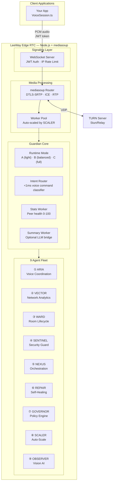
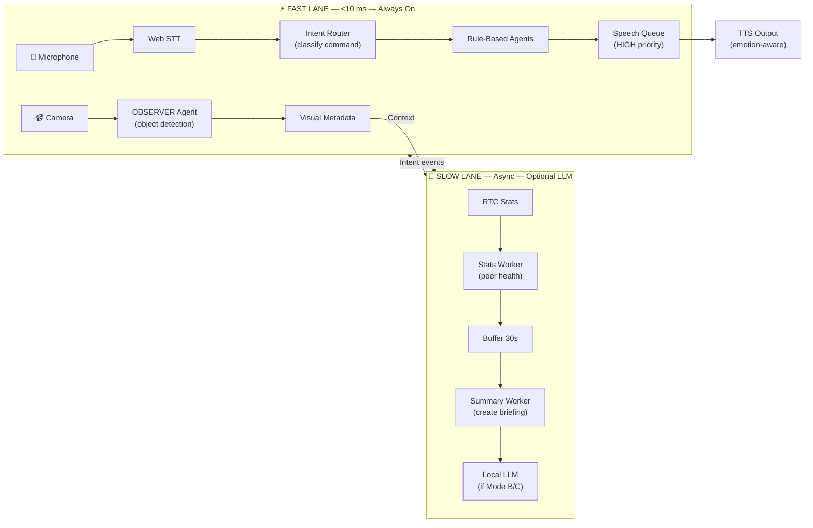
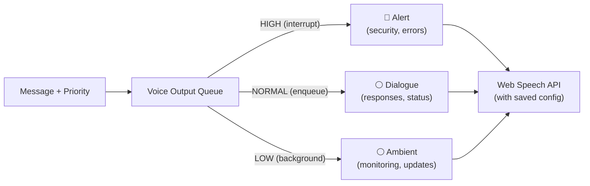
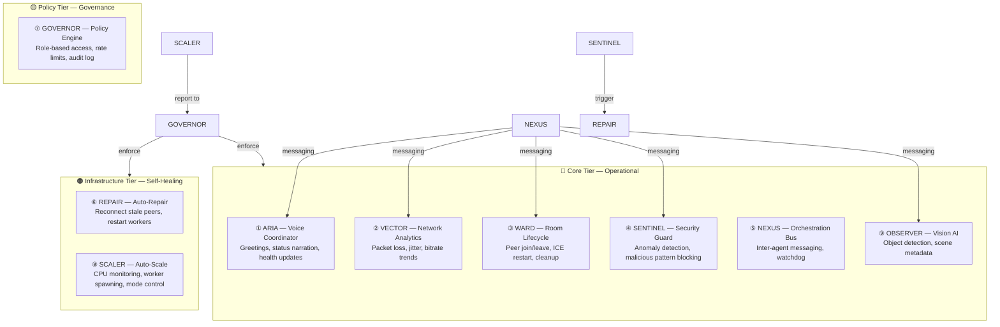

<div align="center">
  
</div>

# LeeWay Edge RTC

**LeeWay Industries | Enterprise Real-Time Communication Backbone**

> Self-hosted WebRTC SFU + intelligent voice orchestration. Enterprise-grade, zero vendor AI dependencies, Raspberry Pi to bare metal.

---

## What LeeWay Edge RTC Does

LeeWay Edge RTC is a **complete real-time communication platform** that handles:

- ✅ **Multi-room WebRTC routing** — mediasoup SFU for audio/video at scale
- ✅ **Intelligent voice processing** — Live STT, emotion-aware TTS, 6 neural voices
- ✅ **Self-managing agent fleet** — 9 autonomous agents handle health, security, scaling, healing
- ✅ **Sub-10ms latency** — Two-lane architecture: fast lane for voice commands, slow lane for diagnostics
- ✅ **Zero external AI** — Runs entirely offline; no cloud TTS, no vendor LLMs (optional local LLM support)
- ✅ **Production ready** — Docker, Kubernetes, multi-region capable, Prometheus metrics, JWT auth

---

## Core Architecture

LeeWay Edge RTC is built around a **signaling hub + media processing pipeline + autonomous agent system**:



---

## Two-Lane Processing Model

Voice commands need <10ms response. Diagnostics can wait. LeeWay splits the workload:



**Runtime Modes** (set via `LEEWAY_MODE` env var):

| Mode | LLM? | Dashboard? | Use Case | Agent Ticks | Workers |
|------|------|-----------|----------|-------------|---------|
| **ultra-light** | ❌ | ❌ | Edge/Raspberry Pi | 3x slower | 1 |
| **balanced** | ✅ optional | ✅ | Production (default) | normal | 2 |
| **full** | ✅ optional | ✅ | High-capacity servers | normal | CPU count |

Switch modes via `LEEWAY_MODE=ultra-light|balanced|full` or at runtime via GOVERNOR agent.

---

## Voice System

Voice output uses the **browser's native Web Speech API** with configurable voice parameters. System voices vary by browser/OS.

### Voice Configuration

Use **VoiceStudio** component to select and preview system voices:

```tsx
import { VoiceStudio } from 'leeway-edge-rtc';

<VoiceStudio />
```

Saved to `localStorage` as `leeway_voice_custom`. Includes:
- **Voice name** (system voices: "Google UK English Female", etc.)
- **Rate** (0.5–2.0, default 1.0)
- **Pitch** (0.5–2.0, default 1.0)  
- **Volume** (0.0–1.0, default 1.0)

### Playback Priority Queue

Messages are queued and prioritized:



### Call Mode Runtime

**Call Mode** orchestrates real-time voice sessions with automatic SpeechRecognition + TTS:

```tsx
import { useCallMode } from '@/runtime/CallMode';
import { CallModeUI } from '@/components/CallModeUI';

const callMode = useCallMode();
await callMode.startSession();
// Microphone enabled → processes speech → routes through agent pipeline → speaks response
```

See [docs/integration.md#call-mode-runtime](docs/integration.md#call-mode-runtime) for full API.

---

## Agent Fleet – Self-Managing System

9 autonomous agents run inside the SFU process. They handle everything: room lifecycle, security, auto-scaling, self-healing, policy enforcement.



### Agent Responsibilities

| Agent | Ticker | Responsibility |
|-------|--------|-----------------|
| **ARIA** | event-driven | Voice coordination, greetings, health narration |
| **VECTOR** | 5 sec | Network analytics: packet loss, jitter, bitrate trends |
| **WARD** | 10 sec | Room lifecycle: peer join/leave, ICE restart, cleanup |
| **SENTINEL** | 3 sec | Security: malicious patterns, rate spike detection, blocking |
| **NEXUS** | 15 sec | Central orchestration: event bus, inter-agent messaging |
| **REPAIR** | triggered | Self-healing: reconnect peers, restart failed workers |
| **GOVERNOR** | 30 sec | Policy enforcement: roles, rate limits, audit logging |
| **SCALER** | 60 sec | Infrastructure: CPU/memory monitor, worker spawning |
| **OBSERVER** | 5 sec | Vision: object detection, scene analysis |

---

## Getting Started — Using the SDK

LeeWay Edge RTC is available as an **npm package** for React applications. It includes:

- Headless RTC logic (mediasoup client)
- Voice orchestration hooks
- Pre-built UI components (diagnostics, tuner, agent hub, vision lab)
- Federation router for multi-node setups

### Install the SDK

```bash
npm install leeway-edge-rtc
```

### Use in Your React App

```typescript
import {
  LeewaySDK,
  useRTCStore,
  useCallModeState,
  callModeController,
  DiagnosticSpectrum,
  VoiceTuner,
  VisionPerceptionLab,
  CallModeUI,
  AgentHub,
} from 'leeway-edge-rtc';

// Initialize SDK
const sdk = new LeewaySDK('your-api-key');
const authParams = sdk.getAuthParams();

// In your component
function VoiceApp() {
  const rtcState = useRTCStore();
  const callModeState = useCallModeState();

  return (
    <div>
      <CallModeUI />
      <DiagnosticSpectrum />
      <VoiceTuner />
      <VisionPerceptionLab />
      <AgentHub />
    </div>
  );
}
```

### SDK Components & Hooks

| Export | Type | Purpose |
|--------|------|---------|
| `LeewaySDK` | Class | Initialize and get auth params |
| `useRTCStore()` | Hook | Access RTC state, peer stats, events |
| `useFederationRouter()` | Hook | Multi-node connection routing |
| `DiagnosticSpectrum` | Component | Real-time peer health visualization |
| `VoiceTuner` | Component | Voice preset and emotion controls with persistent config |
| `VoiceStudio` | Component | Interactive voice configuration and preview |
| `CallModeUI` | Component | Real-time call session control (start/stop, mute, interrupt) |
| `VisionPerceptionLab` | Component | Multi-agent optical perception with detection overlays |
| `AgentHub` | Component | Agent status and control panel |
| `EconomicMoat` | Component | Security and metrics dashboard |
| `GalaxyBackground` | Component | Animated voice UI background |

### Environment Setup

Create `.env.local`:

```env
# ─── Client Configuration ─────────────────────────────────────
VITE_SIGNALING_URL=wss://localhost:3000/ws
VITE_HTTP_BASE_URL=http://localhost:3000

# ─── TTS Voice ────────────────────────────────────────────────
TTS_ENABLED=true
TTS_PROVIDER=edge
TTS_VOICE=en-US-ChristopherNeural
TTS_RATE=+0%

# ─── WebRTC ───────────────────────────────────────────────────
RTC_MIN_PORT=40000
RTC_MAX_PORT=40099

# ─── Logging ───────────────────────────────────────────────────
LOG_LEVEL=info
```

---

## Running the Backend (SFU)

The SFU must be running for clients to connect.

### Docker Compose (Recommended)

```bash
docker compose -f deploy/docker-compose.yml up --build
```

Starts:
- **SFU** on port 3000 (mediasoup + WebSocket signaling)
- **TURN server** on ports 3478/5349 (STUN/TURN for NAT traversal)

Features:
- ✅ Automatic WebSocket reconnection (3 attempts, exponential backoff 1s-4s)
- ✅ 10-second connection timeout with detailed error messages
- ✅ JWT-based authentication with rate limiting
- ✅ Health checks at `/health` endpoint

### Local Development

```bash
cd services/sfu
npm install
npm run dev
```

Watches `src/` and rebuilds automatically. For production build:

```bash
npm run build
NODE_ENV=production node dist/index.js
```

---

## Deployment

### To Fly.io ✅ Live

```bash
# Deploy the SFU backend
cd services/sfu
fly deploy --config fly.toml

# Set secrets
fly secrets set JWT_SECRET=<random-secret> --app leeway-sfu
fly secrets set LEEWAY_MODE=balanced --app leeway-sfu
```

**Current Status:**
- ✅ App deployed: `leeway-sfu` on Fly.io
- ✅ Container size: 68 MB (optimized with production build)
- ✅ Health endpoint: `https://leeway-sfu.fly.dev/health`
- ✅ Auto-scaling enabled (min 0, max 2 machines)
- ✅ UDP ports 40000–40099 forwarded for RTP/RTCP

**Monitor deployment:**

```bash
fly logs --app leeway-sfu
fly status --app leeway-sfu
```

### Docker Registry

```bash
docker build -t your-registry/leeway-sfu:latest services/sfu/
docker push your-registry/leeway-sfu:latest

# Use in docker-compose
services:
  sfu:
    image: your-registry/leeway-sfu:latest
    ports:
      - "3000:3000"
      - "40000-40099:40000-40099/udp"
    environment:
      JWT_SECRET: ${JWT_SECRET}
      LEEWAY_MODE: balanced
```

### Kubernetes

See [deployment.md](docs/deployment.md) for Helm chart and multi-region setup.

---

## Health & Monitoring

Once running:

| Endpoint | Purpose |
|----------|---------|
| `GET /health` | System status |
| `GET /metrics` | Prometheus metrics |
| `GET /agents` | Agent registry snapshot |
| `WebSocket /ws` | Real-time signaling |

---

## Troubleshooting

**Cannot connect to SFU?**  
Check `VITE_SIGNALING_URL` and firewall rules for port 3000.

**WebRTC drops?**  
Ensure ports 3000, 3478, 5349, and RTP range (40000–40099) are open.

**Voice not working?**  
Enable `TTS_ENABLED=true` and verify `TTS_VOICE` matches your system.

---

## License

PROPRIETARY — LeeWay Industries. All rights reserved.

For licensing inquiries: **414-303-8580**

---

## Support

- **Full Documentation:** [docs/](./docs/)
- **Issues:** GitHub Issues
- **Community:** Development discussions
