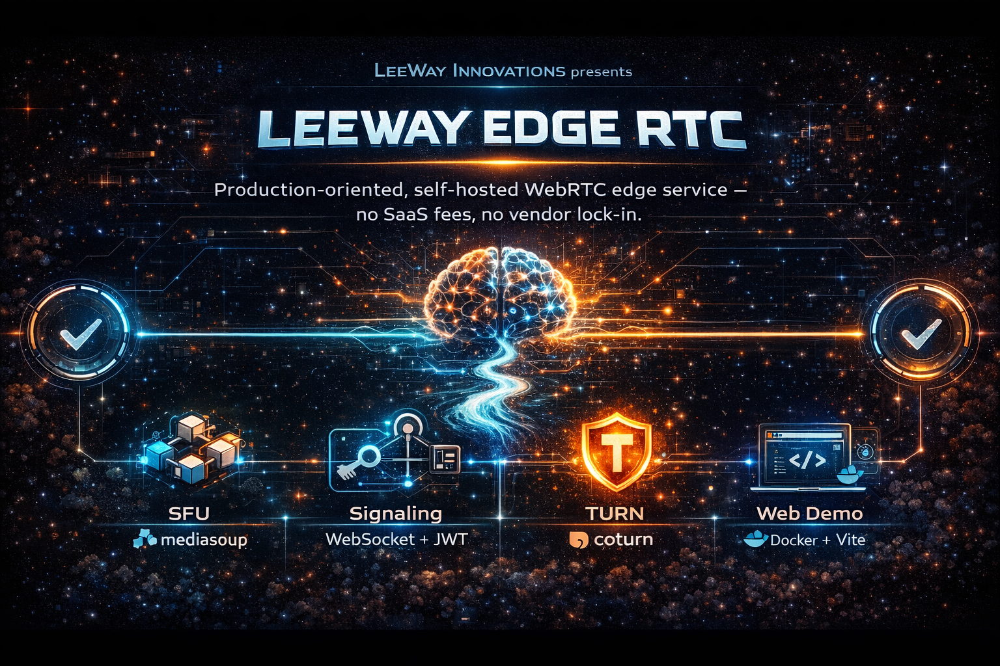
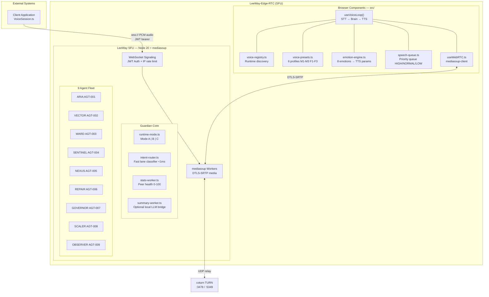
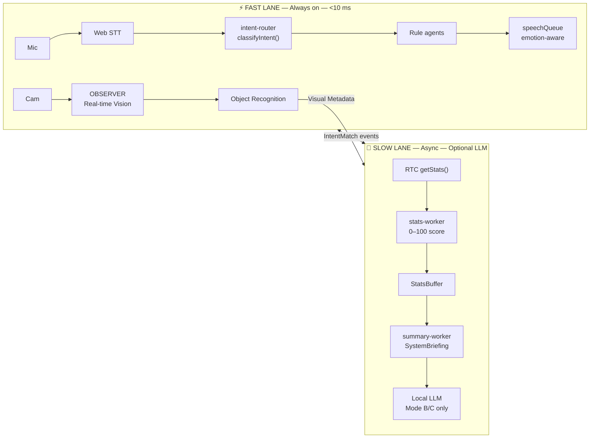
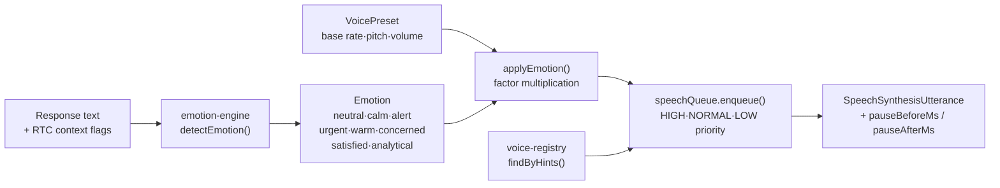
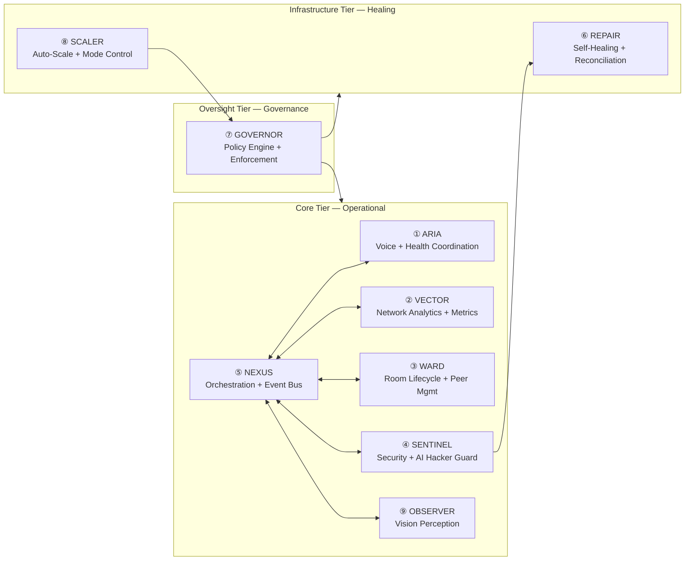

<div align="center">
  
</div>

# LeeWay Edge RTC SDK

**LeeWay Industries | Sovereign Communication Hybrid**

> Real-time WebRTC backbone for voice-enabled AI applications. Enterprise-grade, self-hosted, vendor-agnostic.

---

## What You Get

- ✅ **Headless RTC logic** – Mediasoup SFU for audio/video routing
- ✅ **Voice orchestration** – Speech-to-text, emotion engine, preset voices
- ✅ **React components** – Pre-built UI for diagnostics, voice tuning, and vision
- ✅ **Zero vendor AI** – Run entirely offline; no cloud TTS or AI dependencies
- ✅ **Enterprise ready** – Docker, multi-tenant rooms, JWT auth, Prometheus metrics

---

## Quick Start with SDK

### 1. Install the Package

```bash
npm install leeway-edge-rtc
```

### 2. Use the SDK in Your React App

```typescript
import {
  LeewaySDK,
  useRTCStore,
  DiagnosticSpectrum,
  VoiceTuner,
  AgentHub,
  FederationRouter,
} from 'leeway-edge-rtc';

// Initialize SDK
const sdk = new LeewaySDK('your-api-key');

// Get authentication params
const authParams = sdk.getAuthParams();

// In your component
function VoiceApp() {
  const rtcState = useRTCStore();

  return (
    <div>
      <DiagnosticSpectrum />
      <VoiceTuner />
      <AgentHub />
    </div>
  );
}
```

### 3. Connect to SFU Backend

Set your environment variables:

```bash
VITE_SIGNALING_URL=wss://your-sfu-host/ws
VITE_HTTP_BASE_URL=https://your-sfu-host
```

### 4. Deploy Your App

```bash
npm run build
```

---

## API Reference

### LeewaySDK Class

```typescript
new LeewaySDK(apiKey: string)
  .getAuthParams() → { key: string, timestamp: number }
```

### Hooks & Components

| Export | Type | Purpose |
|--------|------|---------|
| `useRTCStore()` | Hook | Access RTC state, peer stats, connection events |
| `useFederationRouter()` | Hook | Route connections across federated nodes |
| `DiagnosticSpectrum` | Component | Real-time peer health visualization |
| `VoiceTuner` | Component | Voice preset selector and emotion controls |
| `VisionLab` | Component | Video feed diagnostics |
| `AgentHub` | Component | Agent status and control panel |
| `EconomicMoat` | Component | Network security & metrics dashboard |
| `GalaxyBackground` | Component | Animated background for voice UIs |

---

## Environment Variables

Create a `.env.local` file in your project:

```env
# ─── Frontend (Vite) ─────────────────────────────────────────
VITE_BASE_URL=/
VITE_SIGNALING_URL=wss://localhost:3000/ws
VITE_HTTP_BASE_URL=http://localhost:3000

# ─── TTS Configuration ────────────────────────────────────────
TTS_ENABLED=true
TTS_PROVIDER=edge
TTS_VOICE=en-US-ChristopherNeural
TTS_RATE=+0%

# ─── WebRTC ───────────────────────────────────────────────────
RTC_MIN_PORT=40000
RTC_MAX_PORT=40099

# ─── Logging ───────────────────────────────────────────────────
LOG_LEVEL=info
```

---

## Running the Backend

The backend SFU must be running for the SDK to connect.

### Docker

```bash
docker compose -f deploy/docker-compose.yml up --build
```

This starts:
- **SFU** on port 3000 (HTTP + WebSocket)
- **TURN server** on ports 3478/5349

### Local Development

```bash
# Install dependencies
cd services/sfu
npm install

# Build TypeScript
npm run build

# Start server
node dist/index.js
```

The SFU will run on `http://localhost:3000`

---

## Deployment

### To Fly.io

```bash
fly auth login
fly deploy --config services/sfu/fly.toml
```

Set required secrets:
```bash
fly secrets set JWT_SECRET=<your-secret> --app your-app-name
fly secrets set LEEWAY_MODE=balanced --app your-app-name
```

### To Docker Registry

```bash
docker build -t your-registry/leeway-sfu:latest services/sfu/
docker push your-registry/leeway-sfu:latest
```

---

## Monitoring & Health

Once running, check:

| Endpoint | Purpose |
|----------|---------|
| `GET /health` | System health status |
| `GET /metrics` | Prometheus metrics |
| `GET /agents` | Agent registry |
| `WebSocket /ws` | Real-time signaling |

---

## Troubleshooting

**Q: "Cannot connect to SFU"**  
A: Ensure `VITE_SIGNALING_URL` points to your running SFU and CORS is enabled.

**Q: "WebRTC connection drops"**  
A: Check firewall rules for ports 3000, 3478, 5349, and RTP range (40000–40099).

**Q: "Voice not working"**  
A: Enable TTS in `.env` and ensure `TTS_VOICE` matches your system locale.

---

## Architecture & Internal Systems

### System Architecture



### Two-Lane Architecture



| Mode | LLM | Dashboard | Tick speed | Pi 5 safe |
|------|-----|-----------|-----------|-----------|
| **A — ultra-light** | off | off | 3× slower | ✅ yes |
| **B — balanced** | on (local) | on | normal | ⚠️ light |
| **C — full** | on | on | normal | ❌ no |

### Voice Character System

Six neural voice presets stored in `src/voice/voice-presets.ts`:

| Preset | Character | Gender | Emotion best for | Premium HD |
|--------|-----------|--------|-----------------|:---:|
| **M1** — Command | Default system | Male | Alerts, instructions, RTC ops | ✅ |
| **M2** — Calm | Relaxed presence | Male | Status reports, idle monitoring | ✅ |
| **M3** — Alert | Urgent presence | Male | Critical flags, security alerts | ✅ |
| **F1** — Neutral | Diagnostics voice | Female | Health readouts, diagnostics | ✅ |
| **F2** — Warm | Advisory voice | Female | Recommendations, suggestions | — |
| **F3** — Precise | Technical voice | Female | Governance and policy reports | ✅ |



### Agent Fleet – Governance Hierarchy

9 always-on NPC agents run inside the same Node.js process as the SFU.



#### Agent Details

| ID | Codename | Tier | Key Responsibility | Tick | Status |
|----|----------|------|--------------------|------|--------|
| `AGT-001` | **ARIA** | core | Voice coordination, health monitoring, greeting, status narration | event-driven | 🟢 |
| `AGT-002` | **VECTOR** | core | RTC network analytics, packet loss trend analysis, bitrate watches | 5 s | 🟢 |
| `AGT-003` | **WARD** | core | Room lifecycle, peer mute/kick, ICE restart, session cleanup | 10 s | 🟢 |
| `AGT-004` | **SENTINEL** | core | Security scans, error rate spike alerts, AI Hacker Protection | 3 s | 🟢 |
| `AGT-005` | **NEXUS** | core | Agent orchestration, AgentRuntime watchdog, broadcast coordination | 15 s | 🟢 |
| `AGT-006` | **REPAIR** | infrastructure | Auto-repair: reconnect peers, restart workers, reconcile room state | triggered | 🟢 |
| `AGT-007` | **GOVERNOR** | oversight | Policy engine, rule enforcement, agent suspend/resume, audit log | 30 s | 🟢 |
| `AGT-008` | **SCALER** | infrastructure | CPU/load monitoring, worker count adjustment, runtime mode switching | 60 s | 🟢 |
| `AGT-009` | **OBSERVER** | core | Vision perception, real-time object identification and scene analysis | 5 s | 🟢 |

#### Agent Fleet Capabilities

- **ARIA (Voice Coordinator)** — Narrates system state in real time; manages greeting and introduction flows
- **VECTOR (Analytics)** — Continuous packet loss, jitter, and bitrate trend analysis; alerts on network degradation
- **WARD (Room Lifecycle)** — Handles peer joins/leaves, transport resets, ICE candidate refreshes; graceful shutdown
- **SENTINEL (Security)** — Detects malicious patterns, unusual request rates, prompt injection; blocks by agent policy
- **NEXUS (Orchestration)** — Central event bus; inter-agent messaging; runtime state sharing; watchdog for hung agents
- **REPAIR (Self-Healing)** — Monitors failure signals; auto-reconnects stale peers; restarts failed workers; reconciles state
- **GOVERNOR (Policy)** — Enforces role-based access; rate limits; audit logging; suspends/resumes agents on policy breach
- **SCALER (Infrastructure)** — Monitors CPU/memory; spawns/destroys mediasoup workers based on load; switches runtime modes
- **OBSERVER (Vision)** — Processes video frames; runs object detection; extracts scene metadata for context

---


PROPRIETARY — LeeWay Industries. All rights reserved.

For licensing inquiries, contact: **414-303-8580**

---

## Support

- **Documentation:** See [docs/](./docs/) directory
- **Issues:** GitHub Issues
- **Community:** Join our development community
