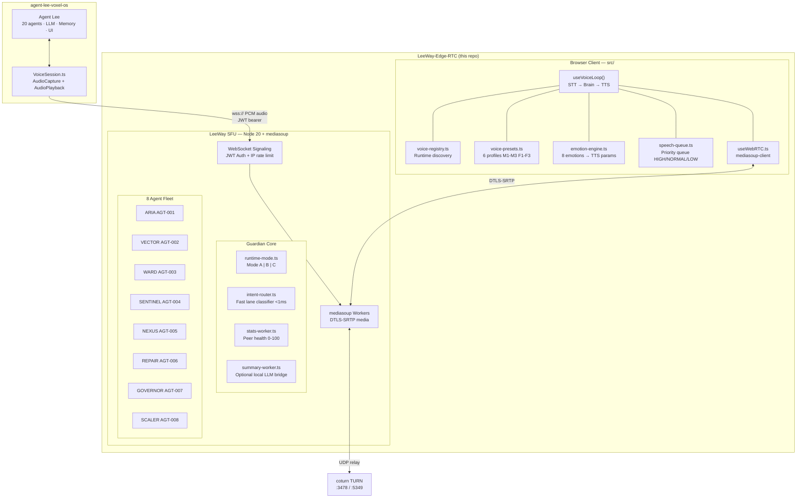
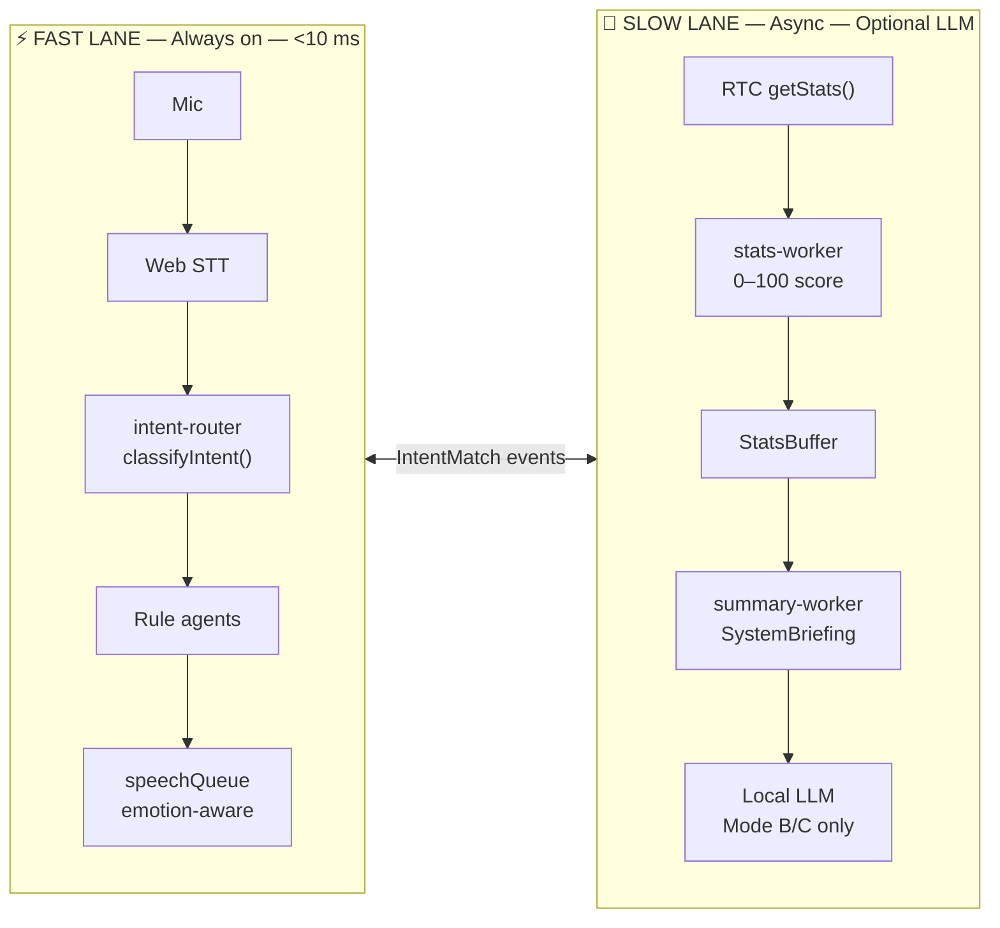
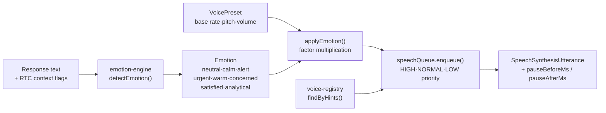
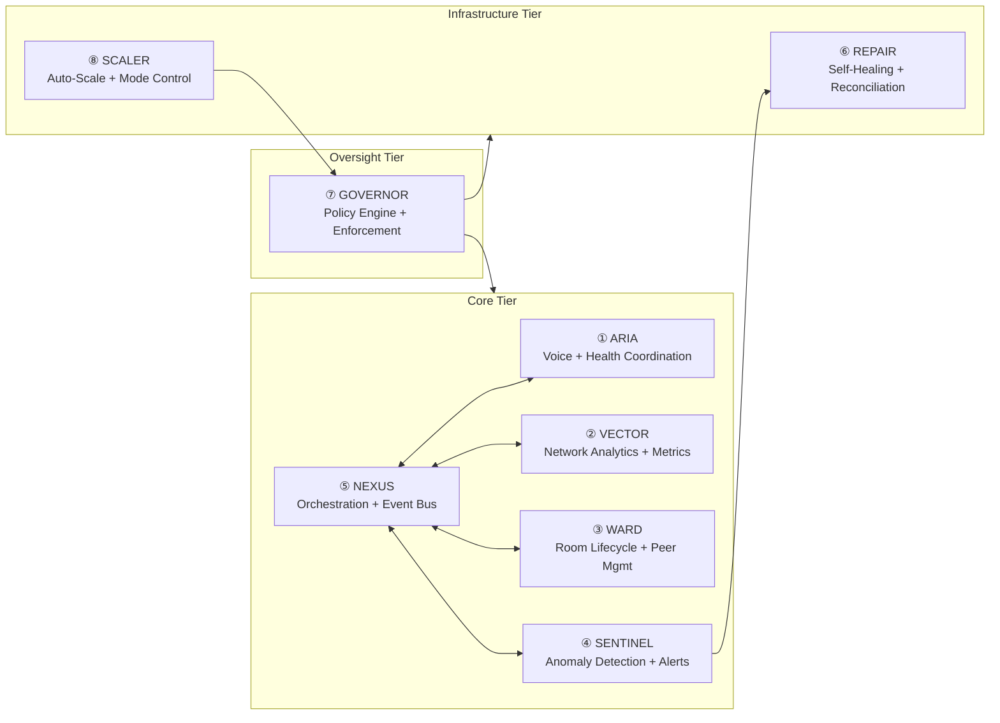

<div align="center">
  
</div>

# LeeWay Edge RTC — Agent Lee's Real-Time Voice Backbone

**LeeWay Industries | LeeWay Innovation — Created by Leonard Lee**

> Agent Lee's live voice, emotion, and WebRTC transport layer. Self-hosted. Vendor-free. Raspberry Pi 5 to bare-metal. Built to give Agent Lee a consistent, emotionally-present voice in every conversation — in real time.

[](https://github.com)
[](https://github.com)

---

## This Is Half of a Pair

```
┌─────────────────────────────────────┐     ┌──────────────────────────────────────────┐
│     agent-lee-voxel-os              │     │     LeeWay-Edge-RTC  ← YOU ARE HERE      │
│                                     │     │                                           │
│  Agent Lee's mind, memory,          │────▶│  Agent Lee's real-time voice, emotion,   │
│  20 agents, UI, LLM, governance,    │ wss │  WebRTC transport, guardian core,         │
│  Firebase, Gemini, llama.cpp        │     │  8 RTC agents, two-lane architecture      │
└─────────────────────────────────────┘     └──────────────────────────────────────────┘
         BRAIN & IDENTITY                              VOICE & PRESENCE
```

| Repo | Purpose | Connect via |
|------|---------|-------------|
| **agent-lee-voxel-os** | Agent Lee's brain — identity, 20 agents, LLM, memory, UI | `VITE_VOICE_WS_URL` → this SFU |
| **LeeWay-Edge-RTC** (this repo) | Agent Lee's voice presence — real-time audio, emotion, WebRTC SFU | `wss://your-sfu-host/ws` |

**Why two repos?** Agent Lee's intelligence (reasoning, memory, UI) runs in voxel-os. His **live voice and emotions** need a dedicated, always-on, low-latency WebRTC backbone so that voice is never blocked by LLM latency. This repo *is* that backbone.

Set one environment variable in voxel-os and the two systems are linked:
```
VITE_VOICE_WS_URL=wss://leeway-sfu.fly.dev/ws
```

---

## What This Repo Delivers

| Capability | Detail |
|-----------|--------|
| **Consistent voice character** | 6 pinnable voice presets (3M + 3F) — same character voice regardless of device or browser |
| **Live emotion** | Rule-based emotion engine maps RTC state and response text → TTS rate/pitch/pause deltas in real time |
| **Priority speech queue** | HIGH barge-in, NORMAL dialogue, LOW ambient — Agent Lee never talks over a critical alert |
| **Two-lane architecture** | Fast lane (deterministic, <10 ms) for voice commands; Slow lane (async) for RTC health diagnostics + optional local LLM |
| **Runtime Mode A/B/C** | Ultra-light (Pi 5 safe) · Balanced · Full — switch by voice or GOVERNOR agent |
| **Self-healing SFU** | 8 NPC agents manage room lifecycle, anomaly detection, auto-repair, policy enforcement, auto-scaling |
| **Zero vendor AI** | No Gemini key, no OpenAI, no cloud TTS — runs offline once deployed |

---

## Architecture



---

## Two-Lane Architecture



| Mode | LLM | Dashboard | Tick speed | Pi 5 safe |
|------|-----|-----------|-----------|-----------|
| **A — ultra-light** | off | off | 3× slower | ✅ yes |
| **B — balanced** | on (local) | on | normal | ⚠️ light |
| **C — full** | on | on | normal | ❌ no |

Switch by voice command: *"switch to minimal mode"* · *"full mode"* · *"balanced mode"*

---

## Voice Character System

Agent Lee has a consistent voice character across all devices. Six presets are stored in `src/voice/voice-presets.ts` and persisted to `localStorage`.

| Preset | Character | Gender | Emotion best for |
|--------|-----------|--------|-----------------|
| **M1** — Command | Agent Lee default | Male | Alerts, instructions, RTC ops |
| **M2** — Calm | Agent Lee relaxed | Male | Status reports, idle monitoring |
| **M3** — Alert | Agent Lee urgent | Male | SENTINEL critical flags |
| **F1** — Neutral | Agent ARIA default | Female | Health readouts, diagnostics |
| **F2** — Warm | Agent ARIA advisor | Female | Recommendations, suggestions |
| **F3** — Precise | Agent ARIA technical | Female | Governance and policy reports |



---

## Agent Fleet

8 always-on NPC agents run inside the same Node.js process as the SFU — zero extra spawned processes.



| ID | Codename | Tier | Key responsibility | Tick |
|----|----------|------|--------------------|------|
| `AGT-001` | **ARIA** | core | Voice coordination, health monitoring, greeting, status narration | event-driven |
| `AGT-002` | **VECTOR** | core | RTC network analytics, packet loss trend analysis, bitrate watches | 5 s |
| `AGT-003` | **WARD** | core | Room lifecycle, peer mute/kick, ICE restart, session cleanup | 10 s |
| `AGT-004` | **SENTINEL** | core | Anomaly detection, error rate spike alerts, security scans | 3 s |
| `AGT-005` | **NEXUS** | core | Agent orchestration, AgentRuntime watchdog, broadcast coordination | 15 s |
| `AGT-006` | **REPAIR** | infrastructure | Auto-repair: reconnect peers, restart workers, reconcile room state | triggered |
| `AGT-007` | **GOVERNOR** | oversight | Policy engine, rule enforcement, agent suspend/resume, audit log | 30 s |
| `AGT-008` | **SCALER** | infrastructure | CPU/load monitoring, worker count adjustment, runtime mode switching | 60 s |

→ Full detail: [docs/agents.md](docs/agents.md) · [docs/guardian-core.md](docs/guardian-core.md)

---

## Quick Start

**Prerequisites:** Node.js 20+

```bash
# 1. Clone and install
git clone https://github.com/LeeWayInnovations/LeeWay-Edge-RTC-main.git
cd LeeWay-Edge-RTC-main

npm install                         # root (browser client)
cd services/sfu && npm install && cd ../..

# 2. Configure environment
cp .env.example .env.local
# Required: JWT_SECRET, ANNOUNCED_IP
# Optional: LEEWAY_MODE=ultra-light|balanced|full  (default: balanced)
#           LEEWAY_LLM_ENDPOINT=http://localhost:11434/api/generate
#           LEEWAY_LLM_MODEL=phi3:mini

# 3. Build SFU
cd services/sfu && npm run build && cd ../..

# 4. Start SFU  (port 3000)
cd services/sfu && node dist/index.js &

# 5. Start browser client  (port 5173)
npm run dev
```

Open http://localhost:5173

Tail all agent logs: `tail -f services/sfu/logs/combined.log | npx pino-pretty`

---

## Connect to agent-lee-voxel-os

In your **agent-lee-voxel-os** `.env.local`:

```bash
#  ── LeeWay Edge RTC connection ──────────────────────────────
VITE_VOICE_WS_URL=wss://leeway-sfu.fly.dev/ws   # or ws://localhost:3000/ws for local dev
VITE_SIGNALING_URL=wss://leeway-sfu.fly.dev/ws
VITE_HTTP_BASE_URL=https://leeway-sfu.fly.dev

#  ── JWT shared secret — must match JWT_SECRET in LeeWay-Edge-RTC ──
VITE_JWT_SECRET=<same-secret-as-sfu>
```

The **`VoiceSession.ts`** client in voxel-os connects automatically on mount. Once the SFU handshake completes:
- Agent Lee's `LiveConductorAgent` receives the `hello` event
- `StreamingSTTAgent` begins streaming partial transcripts via WebSocket
- LeeWay-Edge-RTC's `useVoiceLoop` + `speechQueue` + `emotionEngine` handle all TTS output
- The guardian core `intent-router` classifies every voice command in <1 ms and routes to the correct RTC agent

**Audio path:**
```
voxel-os AudioCapture (PCM 16kHz) → WebSocket → LeeWay SFU
  → mediasoup Router → DTLS-SRTP → other peers
  → stats-worker (health scoring)
  → summary-worker (30s briefing)
  → ARIA narrates health via speechQueue (emotion-aware, preset voice)
```

---

## Deploy

### SFU → Fly.io

```bash
fly auth login
fly secrets set JWT_SECRET=$(openssl rand -hex 32) --app leeway-sfu
fly secrets set LEEWAY_MODE=balanced --app leeway-sfu
flyctl deploy --config services/sfu/fly.toml --remote-only
```

Or push to `main` — `deploy-fly.yml` runs automatically.  
**Required secret:** `FLY_API_TOKEN`

### Browser Client → GitHub Pages

Push to `main`. `deploy-pages.yml` builds and publishes automatically.

**Required GitHub Secrets:**

| Secret | Example |
|--------|---------|
| `VITE_BASE_URL` | `/LeeWay-Edge-RTC-main/` |
| `VITE_SIGNALING_URL` | `wss://leeway-sfu.fly.dev/ws` |
| `VITE_HTTP_BASE_URL` | `https://leeway-sfu.fly.dev` |

---

## API Reference

| Endpoint | Method | Description |
|----------|--------|-------------|
| `/health` | GET | System health + mode status |
| `/metrics` | GET | Prometheus metrics |
| `/agents` | GET | All 8 agent snapshots |
| `/agents/:codename` | GET | Single agent snapshot |
| `/agents/runtime/status` | GET | Status map + mode |
| `/ws` | WebSocket | Signaling + voice + agent event stream |

### WebSocket Message Quick Reference

```typescript
// Client → SFU
{ type: 'auth', token: 'JWT...' }
{ type: 'joinRoom', roomId: string, rtpCapabilities: object }
{ type: 'createTransport', direction: 'send' | 'recv' }
{ type: 'produce', kind: 'audio' | 'video', rtpParameters: object }
{ type: 'consume', producerId: string, rtpCapabilities: object }
{ type: 'transcript', text: string }   // ← Agent Lee voice command → intent-router

// SFU → Client
{ type: 'hello', version, capabilities, sample_rate }
{ type: 'state', state: 'idle'|'listening'|'thinking'|'speaking' }
{ type: 'partial_transcript', text, confidence }
{ type: 'agentEvent', agent: 'ARIA'|'NEXUS'|..., payload: object }
```

---

## Log Files

```
services/sfu/logs/
├── combined.log      ← all logs, NDJSON pino format
├── aria.log          ← AGT-001 voice + health events
├── vector.log        ← AGT-002 metric analysis
├── ward.log          ← AGT-003 room events
├── sentinel.log      ← AGT-004 anomaly alerts
├── nexus.log         ← AGT-005 orchestration
├── repair.log        ← AGT-006 repair actions
├── governor.log      ← AGT-007 policy decisions
├── scaler.log        ← AGT-008 scaling events
└── governance.log    ← policy violations + audit trail
```

Tail pretty: `tail -f services/sfu/logs/combined.log | npx pino-pretty`

---

## Environment Variables

| Variable | Default | Description |
|----------|---------|-------------|
| `JWT_SECRET` | — | **Required.** HS256 signing secret |
| `ANNOUNCED_IP` | — | Public IP for mediasoup ICE candidates |
| `PORT` | `3000` | SFU HTTP + WS port |
| `LEEWAY_MODE` | `balanced` | `ultra-light` · `balanced` · `full` |
| `LEEWAY_LLM_ENDPOINT` | — | Local LLM HTTP endpoint (Mode B/C) |
| `LEEWAY_LLM_MODEL` | `phi3:mini` | Model name for Ollama / llama.cpp |
| `LOG_LEVEL` | from mode | Override pino log level |

See [.env.example](.env.example) for all variables. Never commit `.env.local`.

---

## Documentation

| Doc | Contents |
|-----|---------|
| [docs/guardian-core.md](docs/guardian-core.md) | **Full blueprint** — two-lane architecture, WebRTC layers, all Mermaid diagrams, agent controls, failover tables |
| [docs/architecture.md](docs/architecture.md) | System overview, data flows, deployment topology |
| [docs/agents.md](docs/agents.md) | Agent IDs, governance hierarchy, lifecycle, tool permissions |
| [docs/voice-pipeline.md](docs/voice-pipeline.md) | Voice STT→Brain→TTS, emotion engine, preset table, speech queue |
| [docs/deployment.md](docs/deployment.md) | Fly.io + coturn deployment step-by-step |
| [docs/integration.md](docs/integration.md) | Connecting mobile / native clients and agent-lee-voxel-os |

---

## Ports and Firewall

| Port | Protocol | Purpose |
|------|----------|---------|
| 3000 | TCP | SFU HTTP (health, metrics, agents, WS) |
| 3478 | UDP + TCP | STUN / TURN (coturn) |
| 5349 | UDP + TCP | TURN TLS (coturn) |
| 40000–49999 | UDP | RTP / RTCP media |

> Set `ANNOUNCED_IP` to your public IP so mediasoup ICE candidates are reachable from the internet.

---

## Image Setup

> Save the LeeWay Edge RTC banner image to `docs/images/banner.png` — GitHub serves it in this README automatically. Already referenced; ready to display once file is present.

---

## License

PROPRIETARY — LeeWay Industries | LeeWay Innovation | Leonard Lee. All rights reserved.

**Collaboration & Licensing:** 414-303-8580
