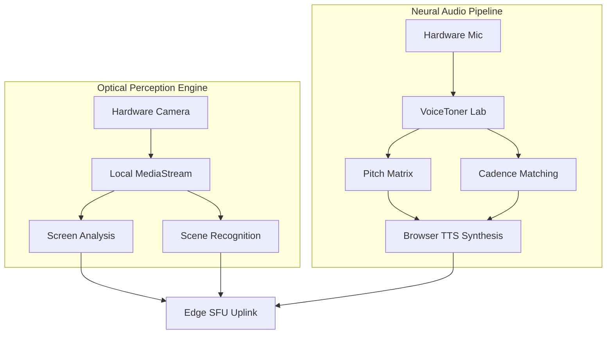

# Intelligence Media Pipelines: Voice & Vision

The LeeWay Edge RTC platform handles rich human outputs—Audio and Video—through proprietary engines designed not merely to "transmit" but to process and react.

## Structural View

## Acoustic Fingerprinting & Neural Voice Synapse

In `VoiceTuner.tsx`, we transition beyond simple robotic TTS. 

1. **Extraction Flow**: Takes inbound human speech and leverages structural DOM layers to map metrics visually.
2. **Measurement Phase**: Evaluates Pitch (F0), Tone clarity, and Speech Cadence.
3. **Synthesis Application**: Directs mapping of these measurements directly onto Microsoft Neural Voice bases (`GuyNeural`, `AriaNeural`). The web's native speech synthesis acts as the physical mouthpiece, dynamically altering the `utterance.pitch` and `utterance.rate` exactly tracking the human's baseline matrix.

Rather than "Voice Cloning", this promotes **Dynamic System Tuning**—offering deep personalization without the processing bloat or vendor entrapment of massive cloud inference endpoints.

## Visual Intelligence (Optical Perception)

The Optical Perception system operates outside simple camera toggles. The platform categorizes what it sees entirely on the client, creating actionable streams of metadata.

**Capabilities Supported**:
* Resolution Scaling (1080p -> 720p fallback upon VECTOR degradation)
* Ambient Frame Rate Drops (preventing battery drain during static frame capture)
* Direct Video Track ingestion straight to the `mediasoup` Transport stream.

As the device compresses media streams through insertable Edge streams (E2EE encryption layer capabilities), neither the central SFU nor LeeWay can decipher the exact stream context, creating a pure zero-trust media grid.
