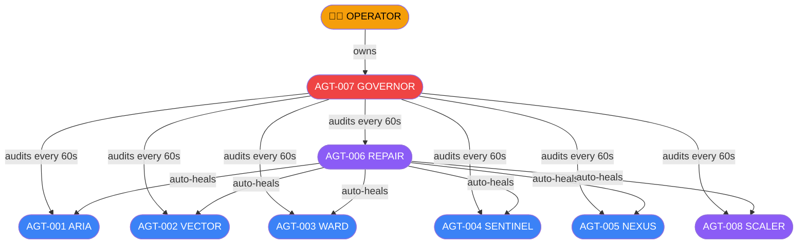
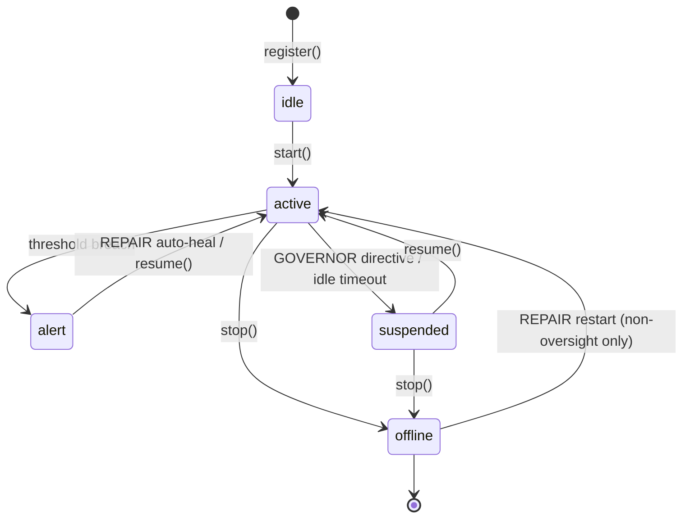
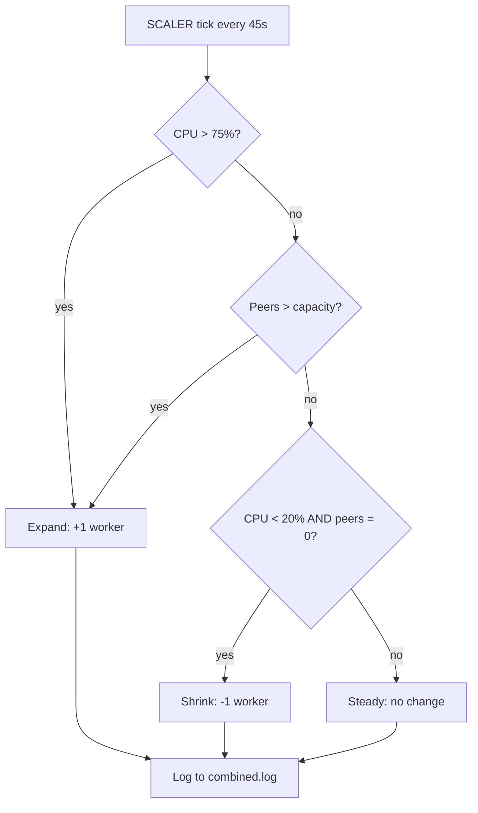

# LeeWay Agent Registry

**LeeWay Industries | LeeWay Innovation — Created by Leonard Lee**

All 8 agents run inside a **single Node.js process** (the SFU). The `AgentRuntime` singleton enforces one instance per agent, governs lifecycle, and prevents CPU/battery drain on edge devices.

---

## Agent Fleet

| ID | Codename | Role | Tier | Tick | Reports To |
|---|---|---|---|---|---|
| `AGT-001` | **ARIA** | Health Monitor | core | 30 s | GOVERNOR |
| `AGT-002` | **VECTOR** | Metrics Analyst | core | 15 s | GOVERNOR |
| `AGT-003` | **WARD** | Room Janitor | core | 60 s | GOVERNOR |
| `AGT-004` | **SENTINEL** | Security Guard | core | 20 s | GOVERNOR |
| `AGT-005` | **NEXUS** | Runtime Watchdog | core | 45 s | GOVERNOR |
| `AGT-006` | **REPAIR** | Auto-Repair | infrastructure | 25 s | GOVERNOR |
| `AGT-007` | **GOVERNOR** | Master Governance | **oversight** | 60 s | OPERATOR |
| `AGT-008` | **SCALER** | Auto-Scaler | infrastructure | 45 s | GOVERNOR |

> **Oversight tier** agents (GOVERNOR) are immune to auto-suspension, peer suspension, and auto-restart. Only an operator `SIGTERM` can shut them down.

---

## Governance Hierarchy



---

## Agent Lifecycle



---

## Runtime Architecture

```mermaid
graph LR
  subgraph Node["Single Node.js Process (services/sfu)"]
    direction TB
    RT[AgentRuntime\nSingleton]
    BUS[AgentBus\nEventEmitter]
    GOV_ENGINE[governance.ts\nPolicy Engine]

    subgraph Fleet["Agent Fleet"]
      ARIA --- VECTOR --- WARD --- SENTINEL --- NEXUS --- REPAIR --- GOVERNOR --- SCALER
    end

    RT -->|start/stop/suspend/resume| Fleet
    Fleet -->|broadcast()| BUS
    RT -->|evaluateAgent()| GOV_ENGINE
  end

  subgraph Logs["logs/ directory"]
    COMBINED[(combined.log)]
    PER_AGENT[(aria.log\nvector.log\n...)]
    GOV_LOG[(governance.log)]
  end

  subgraph HTTP["HTTP / WS"]
    HEALTH[GET /health]
    METRICS[GET /metrics]
    AGENTS_API[GET /agents\nGET /agents/:codename\nGET /agents/runtime/status]
    WS_SIG[WS /ws]
  end

  Fleet -->|pinoLogger| Logs
  BUS -->|agentEvent| WS_SIG
  Node --> HTTP
```

---

## Agent Tool Permissions

Each agent may only call the tools listed in its `governance.tools` array. `governance.ts` validates every action.

| Codename | Authorised Tools |
|---|---|
| ARIA | `http.get:/health`, `bus.emit` |
| VECTOR | `metrics.read`, `rooms.inspect`, `bus.emit` |
| WARD | `rooms.list`, `rooms.delete`, `bus.emit` |
| SENTINEL | `metrics.read`, `bus.emit`, `governance.log` |
| NEXUS | `process.memoryUsage`, `process.cpuUsage`, `bus.emit` |
| REPAIR | `runtime.resume`, `runtime.restart`, `bus.emit`, `governance.log` |
| GOVERNOR | `runtime.suspend`, `runtime.resume`, `governance.evaluate`, `governance.audit`, `bus.emit` |
| SCALER | `os.cpus`, `os.loadavg`, `rooms.list`, `bus.emit:scalingOrder` |

---

## Governance Rules (enforced every tick)

1. **Rate cap** — no agent may exceed `maxActionsPerMinute`.
2. **Offline guard** — an offline agent must not emit events within 5 s of shutdown.
3. **Tier hierarchy** — oversight-tier agents must have `canSuspendAgents: true`.
4. **Tool permission** — agents may only call tools in their `governance.tools` list.

Violations are written to `logs/governance.log` and broadcast as `alert`-level events to all WebSocket clients.

---

## Scaling Strategy

SCALER (AGT-008) monitors peer count and CPU load to issue `ScalingOrder` events on the agent bus:



`MIN_WORKERS = 1`, `MAX_WORKERS = os.cpus().length`, target: **50 peers per worker**.

---

## Log Files

All logs are written to `services/sfu/logs/`:

| File | Contents |
|---|---|
| `combined.log` | Everything — system + all agents |
| `aria.log` | ARIA health check events only |
| `vector.log` | VECTOR telemetry events only |
| `ward.log` | WARD room sweep events only |
| `sentinel.log` | SENTINEL security events only |
| `nexus.log` | NEXUS runtime events only |
| `repair.log` | REPAIR heal cycle events only |
| `governor.log` | GOVERNOR audit events only |
| `scaler.log` | SCALER scaling decisions only |
| `governance.log` | Policy violations + audit trail |

Format: newline-delimited JSON (pino). Tail with: `tail -f services/sfu/logs/combined.log | pino-pretty`
