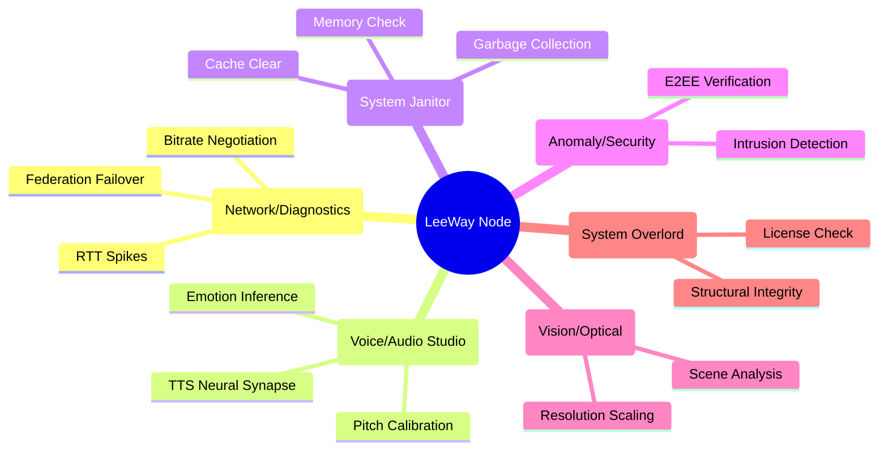
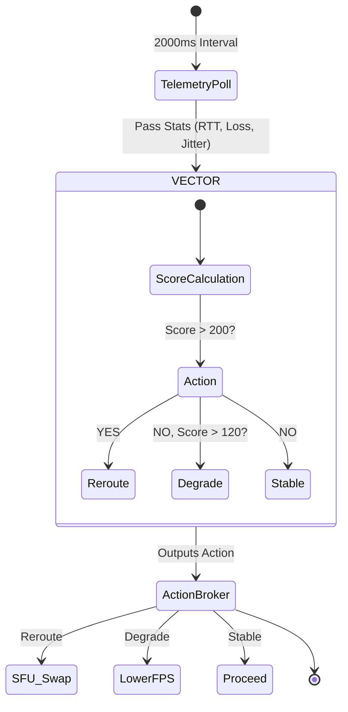

# Autonomous Agent Ecosystem

The LeeWay Edge RTC framework operates via an automated task force of intelligence modules. Rather than a flat, unmanaged codebase, the entire WebRTC environment is stewarded by specialized agents that monitor, repair, and enforce architectural integrity.

## Agent Hierarchy & Sub-Routines

## The Real-Time Decision Matrix

In the heart of the system (`src/rtc/store.ts`), the agents do not just sit passively. They employ a real-time event loop.

### 1. VectorAgent
**Location:** `src/rtc/vector-agent.ts`
The analytical brain responsible for making deterministic routing changes based on raw incoming WebRTC packet metadata. Keeps memory buffers of 50 intervals to calculate historical tracking averages.

### 2. Governor
**Location:** `LeeWay-Edge_RTC.tsx`
The primary protector of the LeeWay Standard. Employs React Hooks to actively ensure the underlying core components and headers haven't been adulterated by downstream developers. Triggers an immutable UI lockdown if compromised.
