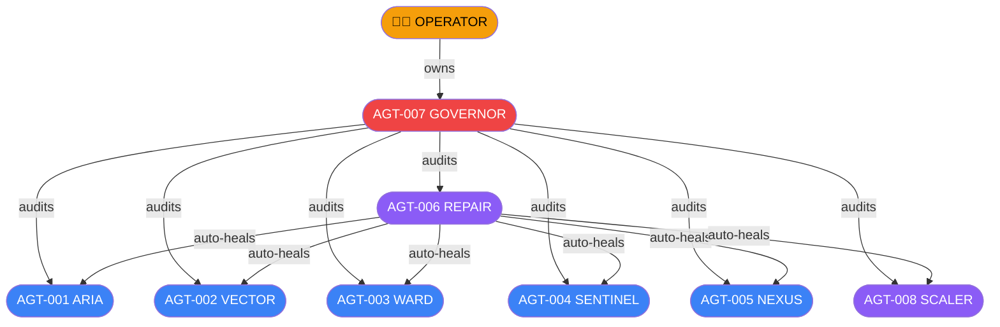
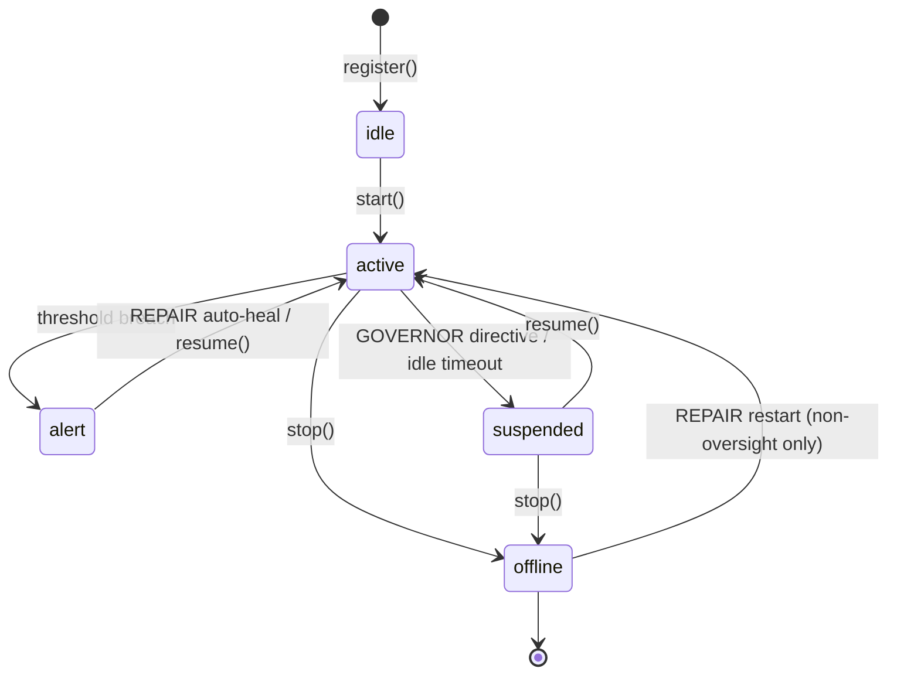

# Agent Fleet & Governance

## Agent Fleet Table

| ID        | Codename   | Role               | Tier         | Tick  | Reports To |
|-----------|------------|--------------------|--------------|-------|------------|
| AGT-001   | ARIA       | Health Monitor     | core         | 30 s  | GOVERNOR   |
| AGT-002   | VECTOR     | Metrics Analyst    | core         | 15 s  | GOVERNOR   |
| AGT-003   | WARD       | Room Janitor       | core         | 60 s  | GOVERNOR   |
| AGT-004   | SENTINEL   | Security Guard     | core         | 20 s  | GOVERNOR   |
| AGT-005   | NEXUS      | Runtime Watchdog   | core         | 45 s  | GOVERNOR   |
| AGT-006   | REPAIR     | Auto-Repair        | infrastructure| 25 s  | GOVERNOR   |
| AGT-007   | GOVERNOR   | Master Governance  | oversight    | 60 s  | OPERATOR   |
| AGT-008   | SCALER     | Auto-Scaler        | infrastructure| 45 s  | GOVERNOR   |

## Governance Hierarchy

## Agent Lifecycle

