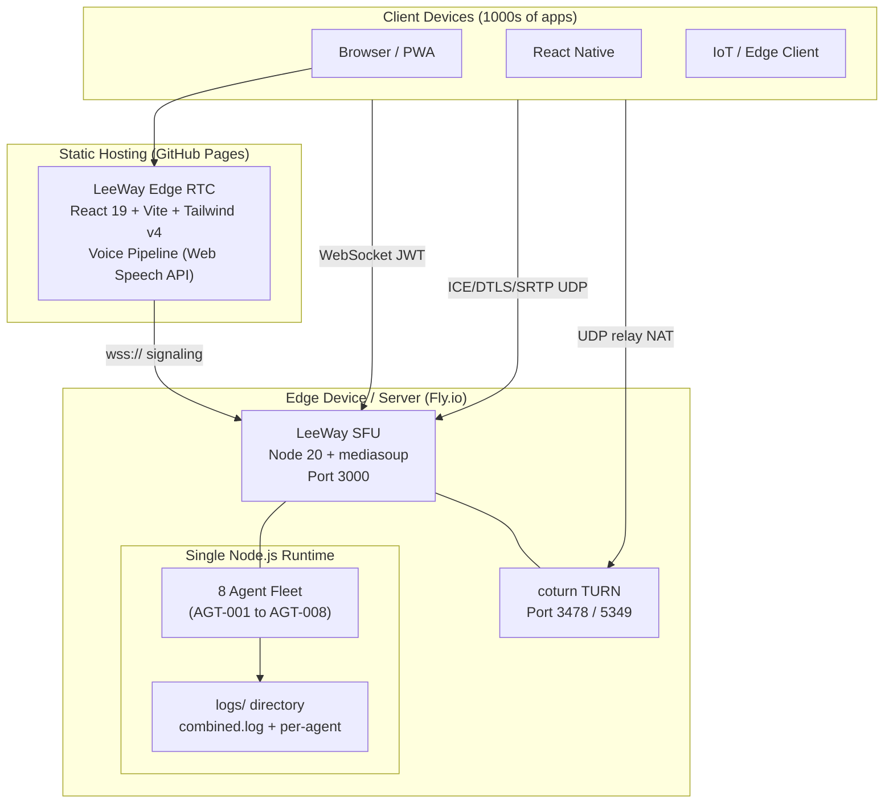
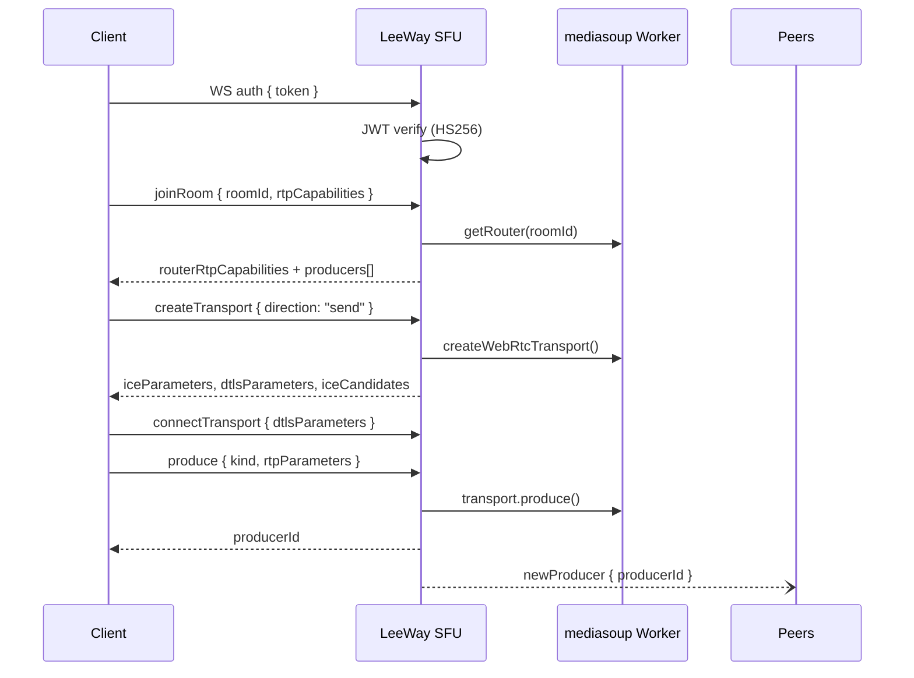
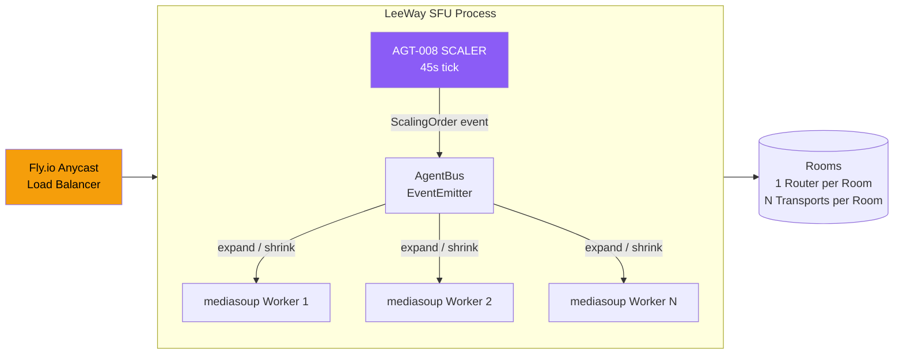
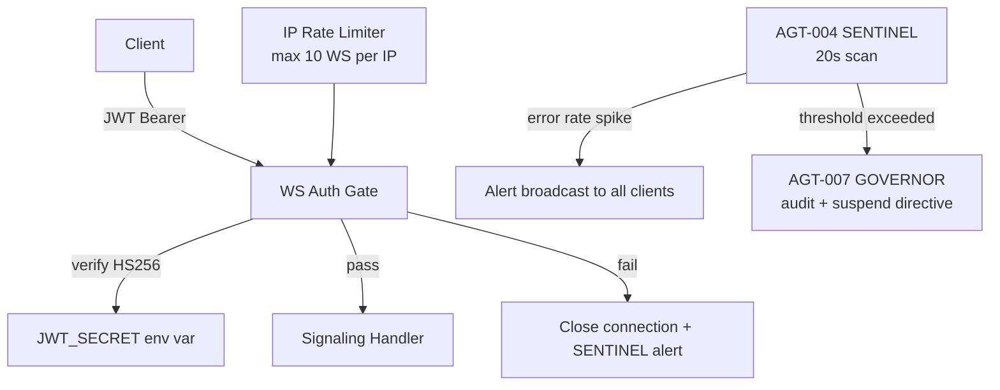
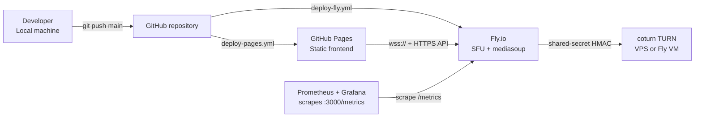
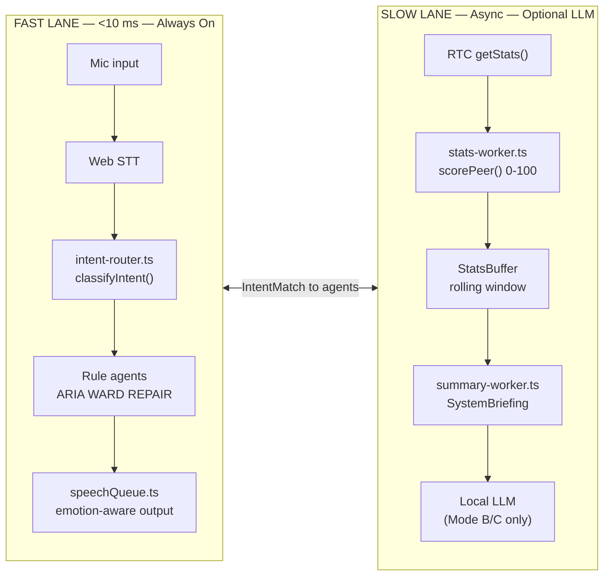

# LeeWay Edge RTC — Architecture

**LeeWay Industries | LeeWay Innovation — Created by Leonard Lee**

---

## System Overview



---

## Data Flow — Publish Path



---

## Data Flow — Subscribe Path

```mermaid
sequenceDiagram
  participant S as Subscriber
  participant SFU as LeeWay SFU
  participant MS as mediasoup Worker

  S->>SFU: createTransport { direction: "recv" }
  SFU->>MS: createWebRtcTransport()
  SFU-->>S: iceParameters, dtlsParameters, iceCandidates
  S->>SFU: connectTransport { dtlsParameters }
  S->>SFU: consume { transportId, producerId, rtpCapabilities }
  SFU->>MS: transport.consume()
  SFU-->>S: consumerId, rtpParameters, producerPaused
  MS--)S: Media over SRTP/UDP
```



---

## Scaling Architecture



---

## Security Model



---

## Deployment Topology



---

## Edge Device Constraints

LeeWay Edge RTC is designed to run on hardware as small as a Raspberry Pi 4:

| Constraint | Strategy |
|---|---|
| CPU throttling | SCALER shrinks workers below 20% CPU; agents use adaptive tick intervals |
| Battery drain | AgentRuntime auto-suspends idle infrastructure agents (`maxIdleMs`) |
| Memory | In-memory log buffer capped at 50 entries per agent; pino async file writes |
| Single runtime | All 8 agents share one Node.js event loop — no spawned processes |
| No duplicate agents | AgentRuntime throws on duplicate registration at boot |
| Log rotation | All logs write to `logs/` as append-only JSON; rotate externally with logrotate |

---

## Component Inventory (Legacy ASCII)

```
┌─────────────────────────────────────────────────────┐
│                  Client (browser / mobile)          │
│  mediasoup-client / WebRTC SDK + Web Speech API     │
└──────────────┬─────────────────┬───────────────────┘
               │ WebSocket (WS)  │ ICE/DTLS/SRTP (UDP)
               ▼                 ▼
┌─────────────────────────┐   ┌────────────────────────┐
│   LeeWay SFU Service    │   │   coturn TURN server   │
│  ┌───────────────────┐  │   │                        │
│  │  Express HTTP     │  │   │  UDP relay for NAT     │
│  │  /health /metrics │  │   │  shared-secret HMAC    │
│  │  /agents REST     │  │   └────────────────────────┘
│  └───────────────────┘  │
│  ┌───────────────────┐  │
│  │  WS Signaling     │  │
│  │  JWT HS256 auth   │  │
│  │  IP rate limiter  │  │
│  └────────┬──────────┘  │
│           │              │
│  ┌────────▼──────────┐  │
│  │  mediasoup        │  │
│  │  Workers (C++)    │  │
│  │  Routers / Rooms  │  │
│  │  Transports       │  │
│  │  Producers        │  │
│  │  Consumers        │  │
│  └───────────────────┘  │
│  ┌───────────────────┐  │
│  │  Agent Runtime    │  │
│  │  AGT-001 ARIA     │  │
│  │  AGT-002 VECTOR   │  │
│  │  AGT-003 WARD     │  │
│  │  AGT-004 SENTINEL │  │
│  │  AGT-005 NEXUS    │  │
│  │  AGT-006 REPAIR   │  │
│  │  AGT-007 GOVERNOR │  │
│  │  AGT-008 SCALER   │  │
│  └───────────────────┘  │
└─────────────────────────┘
               │
               ▼
┌─────────────────────────┐
│  Prometheus / Grafana   │
│  (scrapes /metrics)     │
└─────────────────────────┘
```

```
┌─────────────────────────────────────────────────────┐
│                  Client (browser / mobile)          │
│  mediasoup-client / WebRTC SDK                      │
└──────────────┬─────────────────┬───────────────────┘
               │ WebSocket (WS)  │ ICE/DTLS/SRTP (UDP)
               ▼                 ▼
┌─────────────────────────┐   ┌────────────────────────┐
│   LeeWay SFU Service    │   │   coturn TURN server   │
│                         │   │                        │
│  ┌───────────────────┐  │   │  Relays UDP for NAT    │
│  │  Express HTTP     │  │   │  traversal using       │
│  │  /health /metrics │  │   │  shared-secret HMAC    │
│  └───────────────────┘  │   │  credentials           │
│  ┌───────────────────┐  │   └────────────────────────┘
│  │  WS Signaling     │  │
│  │  JWT auth         │  │
│  │  rate limiting    │  │
│  └────────┬──────────┘  │
│           │              │
│  ┌────────▼──────────┐  │
│  │  mediasoup        │  │
│  │  Workers (C++)    │  │
│  │  Routers / Rooms  │  │
│  │  Transports       │  │
│  │  Producers        │  │
│  │  Consumers        │  │
│  └───────────────────┘  │
└─────────────────────────┘
               │
               ▼
┌─────────────────────────┐
│  Prometheus / Grafana   │
│  (scrapes /metrics)     │
└─────────────────────────┘
```

## Data Flow

### Publish (send) path
1. Client obtains a JWT token (from your auth service, or `/dev/token` in dev mode).
2. Client opens a WebSocket to `/ws`.
3. Client sends `auth { token }`.
4. Client sends `joinRoom { roomId, rtpCapabilities }`.
5. SFU returns `routerRtpCapabilities` + list of existing producers.
6. Client sends `createTransport { direction: "send" }`.
7. SFU creates a mediasoup `WebRtcTransport` and returns ICE/DTLS parameters.
8. Client (mediasoup-client) creates a `SendTransport`, performs ICE/DTLS handshake.
9. Client calls `transport.produce({ track })` → signaling message `produce { kind, rtpParameters }`.
10. SFU creates a mediasoup `Producer`; broadcasts `newProducer` to other room members.

### Subscribe (recv) path
1. Subscriber joins the room (steps 1-5 above, or already joined).
2. Subscriber sends `createTransport { direction: "recv" }` → gets recv transport params.
3. For each producer it wants to receive, subscriber sends `consume { transportId, producerId, rtpCapabilities }`.
4. SFU creates a mediasoup `Consumer`, returns `consumerId + rtpParameters`.
5. Subscriber resumes the consumer via `resumeConsumer`.
6. Audio/video frames flow via SRTP over UDP.

## Simulcast and TWCC

- Publishers can send multiple simulcast layers (r0/r1/r2) using standard WebRTC simulcast.
- mediasoup collects **Transport-CC (TWCC)** feedback and generates RTCP feedback packets automatically.
- Layer selection policy hooks are available in `services/sfu/src/mediasoup/room.ts` (see `consume` method; extend to implement custom preferred-layer selection).

## Security

| Layer | Mechanism |
|---|---|
| Signaling auth | JWT (HS256); token verified before any room action |
| Media encryption | DTLS-SRTP (mandatory; enforced by mediasoup) |
| TURN credentials | Time-limited HMAC-SHA1 shared-secret |
| WebSocket rate limiting | Per-IP connection limit + max message size |

## Ports and Firewall

| Port | Protocol | Purpose |
|---|---|---|
| 3000 | TCP | SFU HTTP (health, metrics, signaling WS) |
| 3478 | UDP + TCP | STUN / TURN |
| 5349 | UDP + TCP | TURN TLS |
| 40000–49999 | UDP | RTP / RTCP media (configurable) |

> **NATed deployment:** set `ANNOUNCED_IP` to your public IP in the SFU env so mediasoup ICE candidates are reachable.

---

## Guardian Core — Two-Lane Architecture

> See [docs/guardian-core.md](./guardian-core.md) for the full blueprint with all Mermaid diagrams.

The Guardian Core divides all system intelligence into two independent lanes:



### Runtime Mode Reference

| Mode | Trigger | LLM | Dashboard | Tick | Pi 5 safe |
|------|---------|-----|-----------|------|-----------|
| `ultra-light` | SCALER / user voice / env var | off | off | 3x slower | yes |
| `balanced` | default | on | on | normal | light load |
| `full` | user command | on | on | normal | no |

Switch modes at runtime via voice command ("switch to minimal mode") or via the GOVERNOR API:
