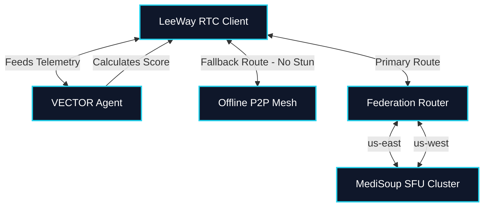
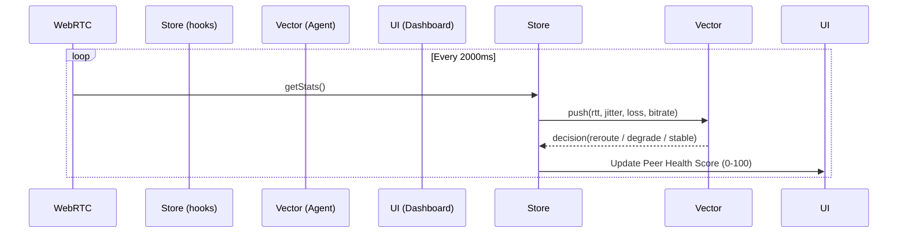

# LeeWay Edge RTC — Sovereign Architecture

> **"A Sovereign, Edge-Computing Decentralized Communication Hybrid"**

The LeeWay Edge RTC system transcends standard WebRTC applications. It is a full ecosystem built to be deployable on edge devices, highly resilient through P2P Mesh Fallbacks, and infinitely scalable through Region-Aware SFU Federation routing.

## High-Level System Structure

The system utilizes a 3-lane routing structure to ensure calls are never dropped, and quality remains intact regardless of the centralized SFU status.

## Advanced Telemetry Pipeline

Telemetric data doesn't just display on a dashboard. In LeeWay Edge RTC, **Telemetry is Actionable Intelligence**. It fuels the autonomous agents to make micro-adjustments in real-time.

### The FAST and SLOW Lanes

1. **FAST LANE (< 10ms)**
   - Metrics: Round Trip Time (RTT), Jitter Buffer Delay, Packet Loss Spikes.
   - Consumers: Real-time UI, Voice Interruption hooks, `MeshFallback` triggers.
   - Action: If RTT spikes > 800ms, the system instantly engages Mesh networking.

2. **SLOW LANE (1s - 5s)**
   - Metrics: Audio Concealment Ratios, Encode/Decode CPU times, Bitrate oscillation.
   - Consumers: `VectorAgent`, Diagnostic Dashboards.
   - Action: If structural degradation happens (Peer Health Score drops below 75), the `VectorAgent` steps in to cleanly re-route the flow or degrade un-necessary video packets.

