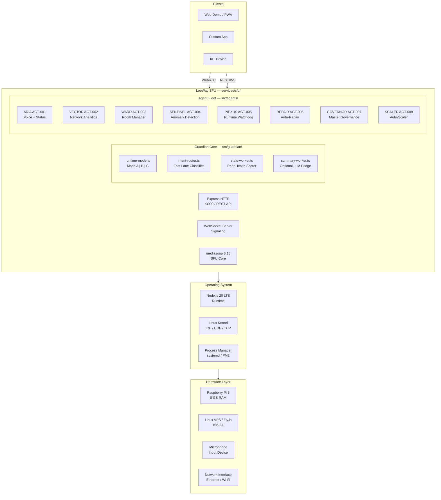

# System Architecture Overview

## Full Stack Layer Model

```mermaid
graph TB
  subgraph HW["Hardware Layer"]
    PI5["Raspberry Pi 5\n8 GB RAM"]
    VPS["Linux VPS / Fly.io\nx86-64"]
    MIC["Microphone\nInput Device"]
    NET["Network Interface\nEthernet / Wi-Fi"]
  end
  subgraph OS["Operating System"]
    NODE["Node.js 20 LTS\nRuntime"]
    KERNEL["Linux Kernel\nICE / UDP / TCP"]
    PROC["Process Manager\nsystemd / PM2"]
  end
  subgraph SFU["LeeWay SFU — services/sfu/"]
    EXPRESS["Express HTTP\n:3000 / REST API"]
    WS["WebSocket Server\nSignaling"]
    MS["mediasoup 3.15\nSFU Core"]
    subgraph GUARDIAN["Guardian Core — src/guardian/"]
      RM["runtime-mode.ts\nMode A | B | C"]
      IR["intent-router.ts\nFast Lane Classifier"]
      SW["stats-worker.ts\nPeer Health Scorer"]
      SUM["summary-worker.ts\nOptional LLM Bridge"]
    end
    subgraph AGENTS["Agent Fleet — src/agents/"]
      ARIA["ARIA AGT-001\nVoice + Status"]
      VECTOR["VECTOR AGT-002\nNetwork Analytics"]
      WARD["WARD AGT-003\nRoom Manager"]
      SENTINEL["SENTINEL AGT-004\nAnomaly Detection"]
      NEXUS["NEXUS AGT-005\nRuntime Watchdog"]
      REPAIR["REPAIR AGT-006\nAuto-Repair"]
      GOVERNOR["GOVERNOR AGT-007\nMaster Governance"]
      SCALER["SCALER AGT-008\nAuto-Scaler"]
    end
  end
  subgraph CLIENTS["Clients"]
    BROWSER["Web Demo / PWA"]
    APP["Custom App"]
    IOT["IoT Device"]
  end
  CLIENTS -->|WebRTC| SFU
  CLIENTS -->|REST/WS| SFU
  SFU --> OS
  OS --> HW
```
