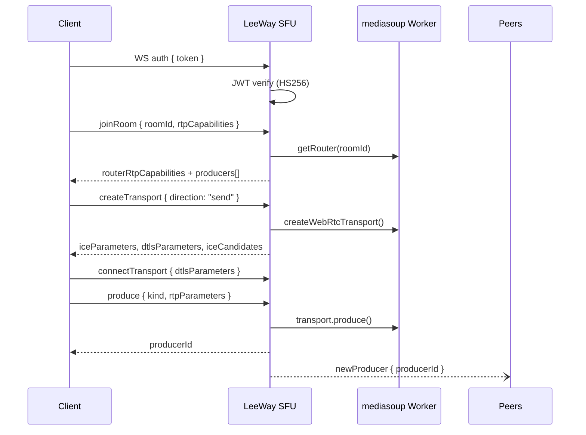
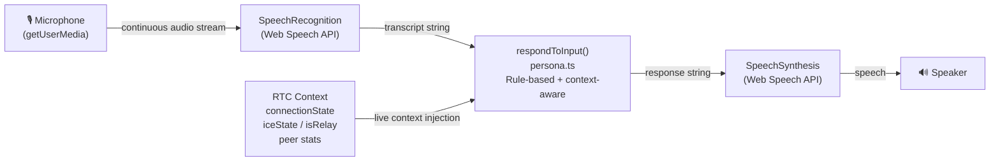

# System Workflow & Data Flow

## RTC Publish/Subscribe Workflow

```mermaid
sequenceDiagram
  participant C as Client
  participant SFU as LeeWay SFU
  participant MS as mediasoup Worker
  C->>SFU: WS auth { token }
  SFU->>SFU: JWT verify (HS256)
  C->>SFU: joinRoom { roomId, rtpCapabilities }
  SFU->>MS: getRouter(roomId)
  SFU-->>C: routerRtpCapabilities + producers[]
  C->>SFU: createTransport { direction: "send" }
  SFU->>MS: createWebRtcTransport()
  SFU-->>C: iceParameters, dtlsParameters, iceCandidates
  C->>SFU: connectTransport { dtlsParameters }
  C->>SFU: produce { kind, rtpParameters }
  SFU->>MS: transport.produce()
  SFU-->>C: producerId
  SFU--)Peers: newProducer { producerId }
```

## Voice Pipeline Workflow

```mermaid
graph LR
  MIC["🎙️ Microphone\n(getUserMedia)"]
  STT["SpeechRecognition\n(Web Speech API)"]
  BRAIN["respondToInput()\npersona.ts\nRule-based + context-aware"]
  TTS["SpeechSynthesis\n(Web Speech API)"]
  SPEAKER["🔊 Speaker"]
  RTC["RTC Context\nconnectionState\niceState / isRelay\npeer stats"]
  MIC -->|continuous audio stream| STT
  STT -->|transcript string| BRAIN
  RTC -->|live context injection| BRAIN
  BRAIN -->|response string| TTS
  TTS -->|speech| SPEAKER
```
