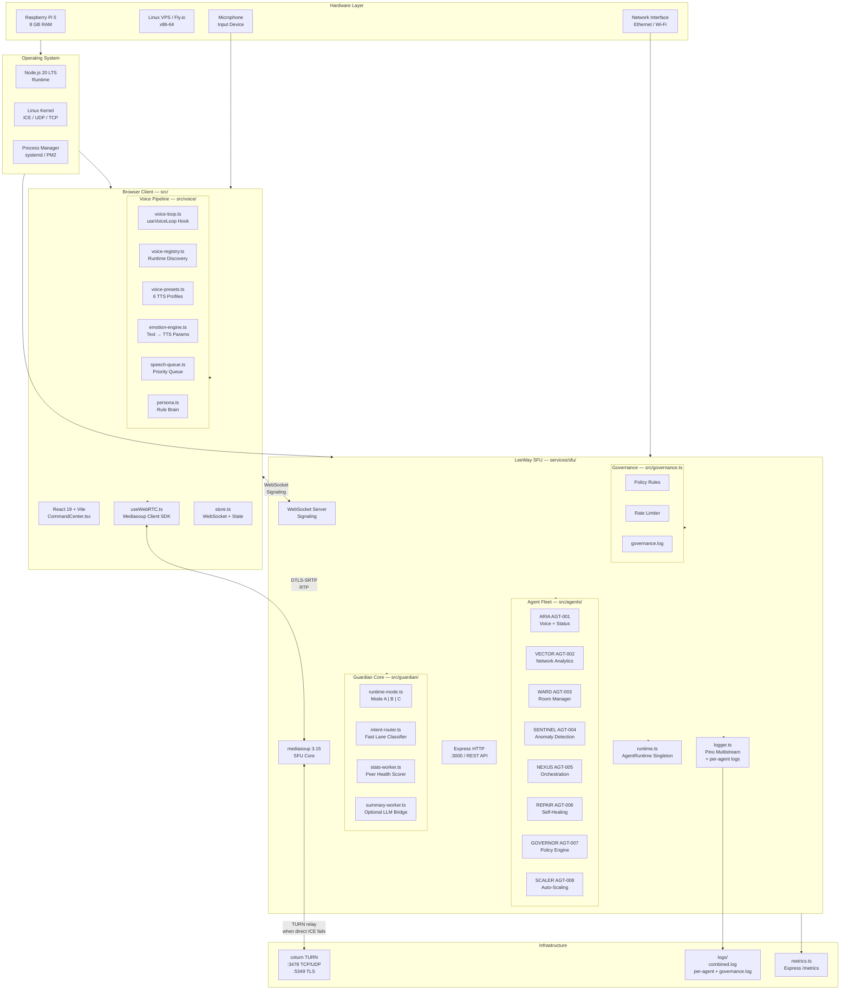
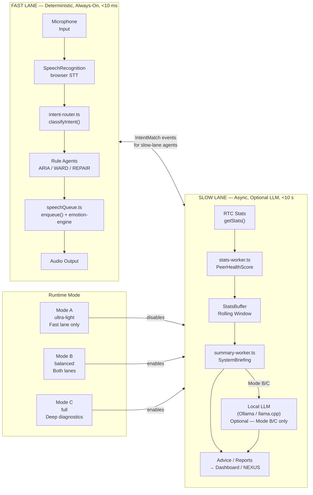
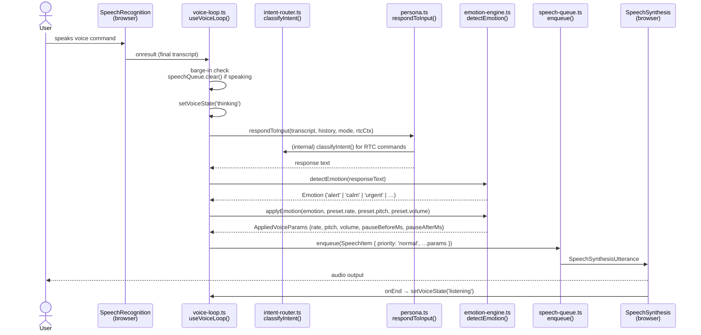
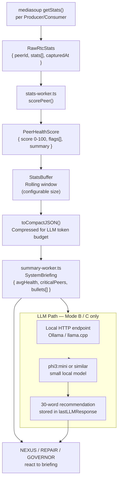
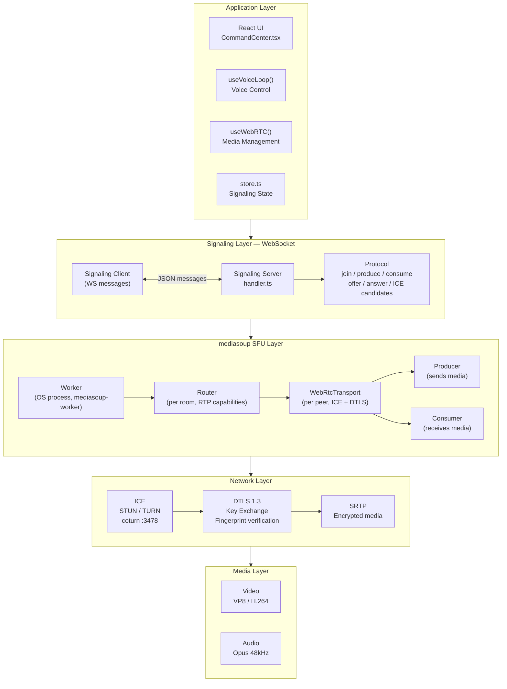
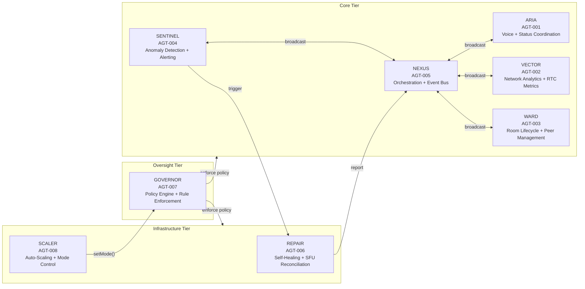
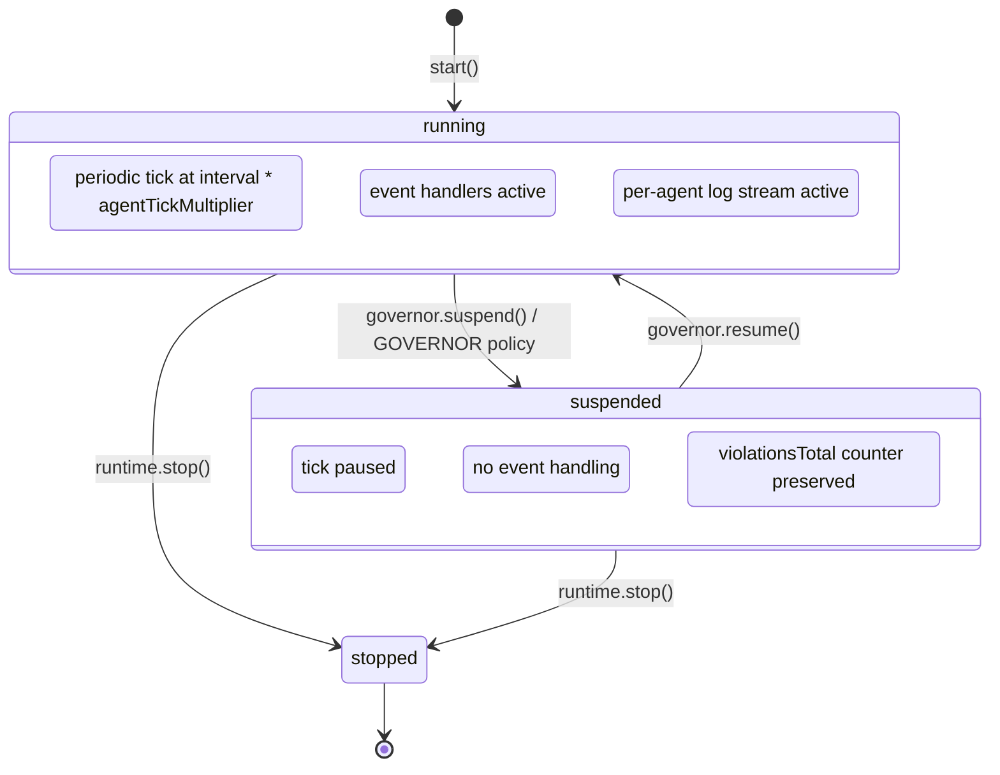
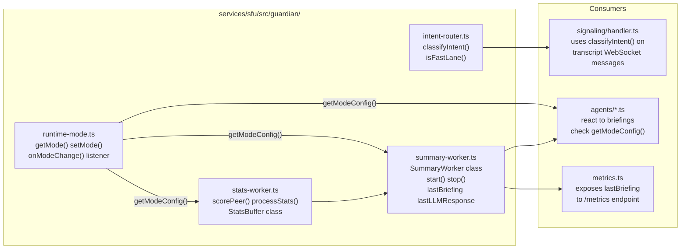
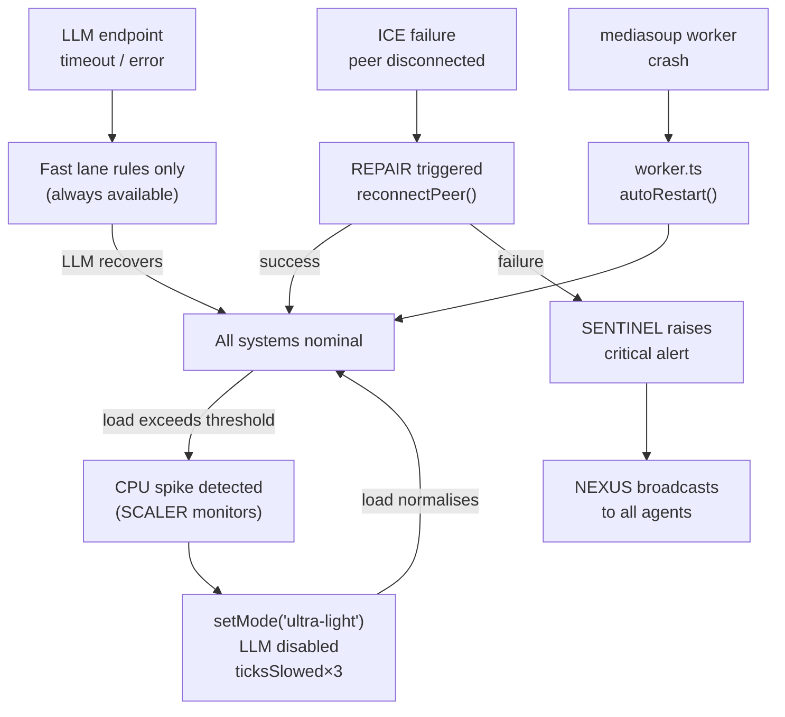
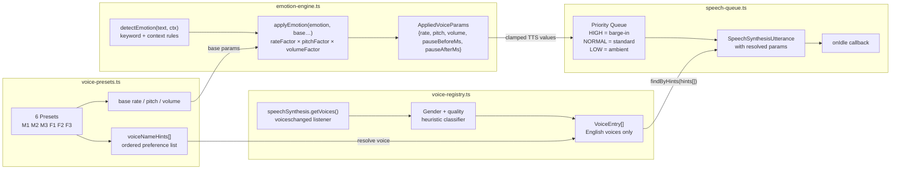

# LeeWay Guardian Core — Full System Blueprint

**LeeWay Industries | LeeWay Innovation — Created by Leonard Lee**

> One binary. Three modes. Raspberry Pi 5 to bare-metal VPS. Zero vendor AI. Self-healing. Self-scaling. Always listening.

---

## Table of Contents

1. [Full Stack Layer Model](#1-full-stack-layer-model)
2. [Two-Lane Architecture](#2-two-lane-architecture)
3. [Fast Lane — Real-Time Voice Control](#3-fast-lane--real-time-voice-control)
4. [Slow Lane — Intelligence Pipeline](#4-slow-lane--intelligence-pipeline)
5. [Runtime Mode System (A / B / C)](#5-runtime-mode-system)
6. [WebRTC Layer Model](#6-webrtc-layer-model)
7. [Agent Fleet — Tools, Purpose, Workflow](#7-agent-fleet)
8. [Guardian Core Module Map](#8-guardian-core-module-map)
9. [Message Interfaces Between Lanes](#9-message-interfaces)
10. [Failover and Degradation](#10-failover-and-degradation)
11. [Voice Enhancement System](#11-voice-enhancement-system)
12. [Repository Layout](#12-repository-layout)

---

## 1. Full Stack Layer Model



---

## 2. Two-Lane Architecture



---

## 3. Fast Lane — Real-Time Voice Control



### Fast Lane Intent Classifications

| Intent | Trigger phrases | Action |
|--------|----------------|--------|
| `query.health` | "status check", "how's the system" | ARIA responds with health summary |
| `query.peers` | "how many peers", "who's connected" | WARD returns peer count |
| `query.latency` | "latency", "round-trip", "ping" | VECTOR reads RTT stats |
| `query.packet-loss` | "packet loss", "dropped packets" | SENTINEL reads loss metrics |
| `control.mute` | "mute [peer]" | WARD issues mute |
| `control.kick` | "disconnect [peer]" | WARD removes peer |
| `control.reconnect` | "reconnect" | REPAIR triggers reconnect |
| `control.reset` | "reset the room" | WARD resets room state |
| `repair.request` | "fix it", "heal", "repair" | REPAIR runs SFU reconciliation |
| `mode.ultra-light` | "minimal mode", "lite mode" | GOVERNOR calls setMode('ultra-light') |
| `mode.full` | "full mode", "everything on" | GOVERNOR calls setMode('full') |
| `agent.suspend` | "suspend [CODENAME]" | GOVERNOR suspends named agent |
| `agent.list` | "list agents", "show agents" | NEXUS returns agent snapshot |

---

## 4. Slow Lane — Intelligence Pipeline



### Peer Health Score Thresholds

| Metric | Warning | Critical | Penalty |
|--------|---------|----------|---------|
| Packet loss | ≥ 3% | ≥ 8% | 18 / 40 pts |
| Jitter | ≥ 40 ms | ≥ 100 ms | 10 / 25 pts |
| Bitrate | < 40 kbps | < 5 kbps (stalled) | 12 / 30 pts |
| RTT | ≥ 200 ms | ≥ 500 ms | 8 / 20 pts |

**Score bands:** 90–100 = Nominal | 70–89 = Degraded | 40–69 = Warning | 0–39 = Critical

---

## 5. Runtime Mode System

```mermaid
stateDiagram-v2
  [*] --> balanced: LEEWAY_MODE env var default
  ultra-light --> balanced: GOVERNOR.setMode('balanced')
  balanced --> ultra-light: SCALER detects high CPU / user says "lite mode"
  balanced --> full: user says "full mode" / GOVERNOR policy
  full --> balanced: SCALER detects sustained normal load
  full --> ultra-light: SCALER detects critical resource pressure

  state ultra-light {
    LLM: disabled
    Dashboard: disabled
    TickMultiplier: 3x (slower ticks)
    Workers: 1
    StatsBuffer: 20 entries
    SummaryInterval: disabled
    LogLevel: warn
  }

  state balanced {
    LLM2: enabled (local endpoint)
    Dashboard2: enabled
    TickMultiplier2: 1x
    Workers2: 2
    StatsBuffer2: 100 entries
    SummaryInterval2: 30s
    LogLevel2: info
  }

  state full {
    LLM3: enabled
    Dashboard3: enabled
    TickMultiplier3: 1x
    Workers3: CPU count
    StatsBuffer3: 500 entries
    SummaryInterval3: 10s
    LogLevel3: debug
  }
```

### Mode Capability Table

| Capability | Mode A ultra-light | Mode B balanced | Mode C full |
|-----------|--------------------|--------------------|------------|
| Fast lane voice control | ✅ | ✅ | ✅ |
| Rule-based intent routing | ✅ | ✅ | ✅ |
| Peer health scoring | ✅ | ✅ | ✅ |
| Slow lane stats buffering | ✅ | ✅ | ✅ |
| LLM summary path | ❌ | ✅ | ✅ |
| Metrics dashboard | ❌ | ✅ | ✅ |
| Deep diagnostic history | ❌ | ❌ | ✅ |
| Raspberry Pi 5 safe | ✅ | ⚠️ light load | ❌ |

---

## 6. WebRTC Layer Model



### ICE Candidate Priority Order

```
1. host          — same LAN, no STUN needed
2. srflx         — NAT mapped via STUN (coturn :3478)
3. relay         — TURN relay via coturn TCP/TLS (:5349)
```

### DTLS Role Assignment

| Side | Role |
|------|------|
| SFU (mediasoup) | `server` — holds certificate, drives handshake |
| Browser | `client` — validates fingerprint from SDP |

---

## 7. Agent Fleet

### Agent Overview



### Agent Detail Table

| Agent | ID | Tier | Tick | Tools | Can Suspend |
|-------|----|------|------|-------|-------------|
| ARIA | AGT-001 | core | var | voice, status, greet | no |
| VECTOR | AGT-002 | core | 5s | getRTCStats, analyzeTrend | no |
| WARD | AGT-003 | core | 10s | listPeers, muteP, kickPeer | no |
| SENTINEL | AGT-004 | core | 3s | detectAnomaly, raisAlert | yes |
| NEXUS | AGT-005 | core | 15s | broadcast, orchestrate | no |
| REPAIR | AGT-006 | infra | trigger | reconnectPeer, restartWorker | yes |
| GOVERNOR | AGT-007 | oversight | 30s | enforcePolicy, suspend/resume | no |
| SCALER | AGT-008 | infra | 60s | setMode, addWorker, scaleRoom | yes |

### Agent Lifecycle



### Agent Control API

```typescript
// Get all agent snapshots
const snapshots = runtime.getSnapshots();
// { codename, agentId, tier, state, violationsTotal, tools }

// Suspend a specific agent (GOVERNOR only)
await governor.suspendAgent('SENTINEL');

// Resume
await governor.resumeAgent('SENTINEL');

// Broadcast to all agents via NEXUS
nexus.broadcast({ type: 'alert', level: 'critical', peerId, flags });

// Mode switch (affects all agent tick rates)
setMode('ultra-light'); // → agentTickMultiplier = 3
```

---

## 8. Guardian Core Module Map



### Module Responsibilities

| Module | Exports | Depends on |
|--------|---------|------------|
| `runtime-mode.ts` | `getMode`, `setMode`, `getModeConfig`, `onModeChange` | `node:os` |
| `intent-router.ts` | `classifyIntent`, `isFastLane`, `Intent`, `IntentMatch` | nothing |
| `stats-worker.ts` | `scorePeer`, `processStats`, `StatsBuffer` | nothing |
| `summary-worker.ts` | `SummaryWorker`, `SystemBriefing`, `LLMResponse` | `stats-worker`, `runtime-mode` |

---

## 9. Message Interfaces

### Fast Lane → Slow Lane

```typescript
// When fast lane handles a control intent, it emits this to slow-lane agents
interface FastLaneEvent {
  type: 'fast-lane-action';
  intent: Intent;          // 'control.mute' | 'repair.request' | etc.
  target?: string;         // peer ID or agent codename
  transcript: string;      // raw user speech
  confidence: 'high' | 'low';
  ts: number;
}
```

### Slow Lane → Agents

```typescript
// SystemBriefing emitted by SummaryWorker every summaryIntervalMs
interface SystemBriefing {
  ts: string;              // ISO timestamp
  avgHealth: number;       // 0-100 averaged across all peers
  criticalPeers: number;   // how many peers scored below 40
  totalPeers: number;      // connected peer count
  mode: string;            // current runtime mode label
  bullets: string[];       // concise human-readable summary lines
  rawContext?: object;     // compact JSON for LLM (never raw stat arrays)
}
```

### Agent Snapshot (NEXUS broadcast shape)

```typescript
interface AgentSnapshot {
  codename: string;           // 'ARIA' | 'VECTOR' | etc.
  agentId: string;            // 'AGT-001' | etc.
  tier: 'core' | 'oversight' | 'infrastructure';
  state: 'running' | 'suspended' | 'stopped';
  violationsTotal: number;    // governance violation counter
  tools: string[];            // tool names this agent is allowed to call
}
```

---

## 10. Failover and Degradation



### Degradation Guarantees

| Failure | System behaviour | Recovery |
|---------|-----------------|----------|
| LLM endpoint down | Slow lane continues without advice; fast lane unaffected | Automatic retry next interval |
| mediasoup worker crash | `worker.ts` detects death and restarts new worker | ~2 s downtime per room |
| TURN server down | Direct ICE candidates still tried; RELAY candidates fail gracefully | Manual coturn restart |
| SENTINEL suspended | Health scores still computed; no alerts raised | GOVERNOR resumes on next policy check |
| Mode A forced | LLM + dashboard off; all voice commands still handled in < 10 ms | SCALER promotes mode when resources free |
| SFU restart | All WS clients auto-reconnect via useWebRTC exponential backoff | < 5 s reconnect |

---

## 11. Voice Enhancement System

### Voice Pipeline



### Voice Preset Table

| ID | Label | Gender | Base Rate | Base Pitch | Personality |
|----|-------|--------|-----------|------------|-------------|
| M1 | Agent Lee — Command | Male | 1.00 | 0.95 | Authoritative, clear — default RTC ops |
| M2 | Agent Lee — Calm | Male | 0.88 | 0.90 | Measured, reassuring — low-urgency reports |
| M3 | Agent Lee — Alert | Male | 1.15 | 1.05 | Fast, high-energy — SENTINEL alerts |
| F1 | Agent ARIA — Neutral | Female | 1.00 | 1.00 | Professional — health monitoring |
| F2 | Agent ARIA — Warm | Female | 0.92 | 0.97 | Soft, warm — advisory output |
| F3 | Agent ARIA — Precise | Female | 1.08 | 1.02 | Crisp, technical — diagnostics |

### Emotion → TTS Mapping

| Emotion | Rate × | Pitch × | Volume × | Pause Before | Pause After |
|---------|--------|---------|---------|-------------|------------|
| neutral | 1.00 | 1.00 | 1.00 | 0 ms | 200 ms |
| calm | 0.88 | 0.96 | 0.88 | 120 ms | 350 ms |
| alert | 1.10 | 1.04 | 1.00 | 0 ms | 120 ms |
| urgent | 1.22 | 1.08 | 1.00 | 0 ms | 0 ms |
| warm | 0.92 | 0.97 | 0.88 | 160 ms | 420 ms |
| concerned | 0.86 | 0.94 | 0.84 | 200 ms | 450 ms |
| satisfied | 0.94 | 1.02 | 0.90 | 0 ms | 320 ms |
| analytical | 0.94 | 0.97 | 0.90 | 60 ms | 260 ms |

### Emotion Detection Keywords

```
URGENT    → CRITICAL, EMERGENCY, FAILED, DOWN, OFFLINE, BREACH, THREAT
ALERT     → WARNING, ALERT, DEGRADED, HIGH PACKET, ANOMALY, SPIKE
SATISFIED → NOMINAL, STABLE, HEALTHY, CONNECTED, ONLINE, OK, CLEAN
ANALYTICAL→ ANALYZING, SCANNING, PROCESSING, CHECKING, INSPECTING
WARM      → RECOMMEND, SUGGEST, CONSIDER, ADVISE, HELP, ASSIST
CALM      → MONITORING, WATCHING, OBSERVING, IDLE, QUIET, STANDBY
```

---

## 12. Repository Layout

```
LeeWay-Edge-RTC-main/
├── README.md
├── tsconfig.json                    ← root TS config (DOM lib, ESNext, bundler)
│
├── src/                             ← browser client source
│   ├── App.tsx                      ← top-level component
│   ├── CommandCenter.tsx            ← main UI
│   ├── main.tsx                     ← entry point
│   ├── RemoteAudio.tsx              ← remote peer audio element
│   ├── useWebRTC.ts                 ← mediasoup-client React hook
│   └── voice/
│       ├── audio.ts                 ← PCM worklet (optional WS voice path)
│       ├── emotion-engine.ts        ← text → TTS param deltas  ←NEW
│       ├── persona.ts               ← rule-based AI brain
│       ├── poetry.ts                ← ambient phrase library
│       ├── speech-queue.ts          ← priority TTS queue          ←NEW
│       ├── types.ts                 ← shared types
│       ├── voice-loop.ts            ← useVoiceLoop() React hook (UPDATED)
│       ├── voice-presets.ts         ← 6 voice profiles            ←NEW
│       ├── voice-registry.ts        ← runtime voice discovery      ←NEW
│       └── voice-loop.ts
│
├── services/sfu/                    ← Node.js SFU backend
│   ├── package.json
│   ├── tsconfig.json                ← SFU TS config (CommonJS, ES2022)
│   └── src/
│       ├── index.ts                 ← entry point
│       ├── server.ts                ← Express + WS setup
│       ├── auth.ts                  ← JWT validation
│       ├── config.ts                ← typed config loader
│       ├── logger.ts                ← pino multistream
│       ├── metrics.ts               ← /metrics endpoint
│       ├── agents/
│       │   ├── aria.ts              ← AGT-001
│       │   ├── vector.ts            ← AGT-002
│       │   ├── ward.ts              ← AGT-003
│       │   ├── sentinel.ts          ← AGT-004
│       │   ├── nexus.ts             ← AGT-005
│       │   ├── repair.ts            ← AGT-006
│       │   ├── governor.ts          ← AGT-007
│       │   └── scaler.ts            ← AGT-008
│       ├── governance.ts            ← policy engine + rate limiter
│       ├── runtime.ts               ← AgentRuntime singleton
│       ├── guardian/                ← Guardian Core              ←NEW
│       │   ├── runtime-mode.ts      ← Mode A / B / C
│       │   ├── intent-router.ts     ← fast lane classifier
│       │   ├── stats-worker.ts      ← RTC health scorer
│       │   └── summary-worker.ts    ← LLM bridge (optional)
│       ├── mediasoup/
│       │   ├── room.ts              ← Room class
│       │   └── worker.ts            ← Worker lifecycle
│       └── signaling/
│           └── handler.ts           ← WS message handler
│
├── clients/web-demo/                ← legacy demo (reference)
├── configs/                         ← example configs
├── deploy/                          ← docker-compose + systemd
│   └── coturn/turnserver.conf
├── docs/
│   ├── architecture.md              ← system architecture
│   ├── agents.md                    ← agent fleet reference
│   ├── guardian-core.md             ← THIS FILE — full blueprint
│   ├── voice-pipeline.md            ← voice system
│   ├── deployment.md                ← deployment guide
│   └── integration.md               ← integration guide
└── logs/                            ← runtime log output (git-ignored)
    ├── combined.log
    ├── ARIA.log
    ├── VECTOR.log
    └── governance.log
```

---

*LeeWay Industries | LeeWay Innovation — Created by Leonard Lee*  
*Self-hosted. Vendor-free. Built for the edge.*
