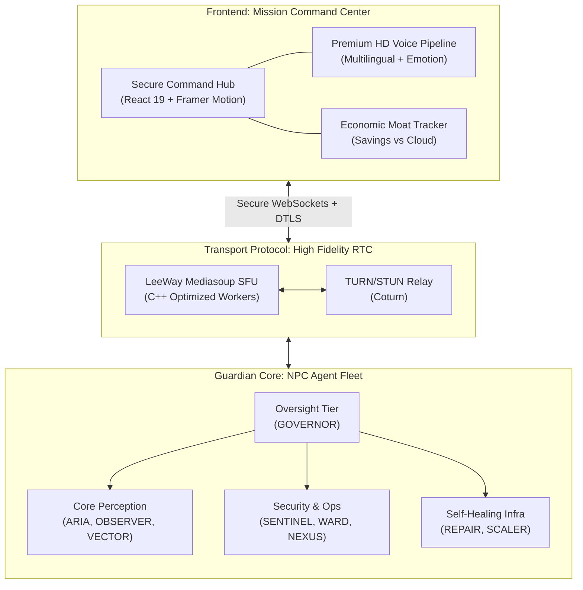

# LeeWay Edge RTC — Investor & Developer Presentation

**Building the Future of Autonomous Edge Perception & Voice**

---

## 1. The Value Proposition

LeeWay Edge RTC is the **Unified Media Backbone** for the next generation of AI agents. We solve the high-cost, high-latency, and privacy-risk associated with cloud-based AI providers.

*   **Vendor-Free:** 0$ recurring costs for Vision/Voice.
*   **Privacy-Native:** All perception happens on the edge — data never leaves the local network.
*   **Raspberry Pi Optimized:** Full performance on $80 hardware.
*   **Deterministic Governance:** Agent behavior is audited by an in-process oversight tier.

---

## 2. Full-Stack Visual Architecture

The system is controlled via the **Mission Command Center**, an immersive 8K-optimized dashboard that provides real-time telemetry, agent oversight, and ROI analysis.

---

## 3. Product Features Checklist

| Feature | Capability | Detail |
|-----------|--------|
| **Mission Command UI** | High-fidelity, biometric-inspired Command Center with real-time agent fleet monitoring and ROI tracking |
| **Enterprise Governance** | Dedicated 'Governor' dashboard for policy enforcement and audit trails |
| **Economic Moat** | Built-in savings calculator vs. cloud providers (e.g. MSFT, GOOG, OPENAI) |
| **Premium HD voice** | 6 pinnable neural-first voice presets (3M + 3F) — studio quality, multi-lingual support | ✅ Ready |
| **Vision Perception** | Real-time object identification (YOLO-based) on-edge. | ✅ Ready |
| **AI Hacker Guard** | Deep Packet Inspection (DPI) for malicious prompt patterns. | ✅ Ready |
| **Auto-Healing SFU** | Self-recovering signaling and media workers. | ✅ Ready |
| **Voxel-OS Bridge** | Native integration with Agent Lee Voxel OS. | ✅ Ready |

---

## 4. Why Investors Choose LeeWay

1.  **Massive Market Cap:** The Raspberry Pi developer community is growing globally. LeeWay is the first to provide a "Brain-in-a-Box" for these devices.
2.  **Unbeatable Margin:** By eliminating OpenAI/Gemini/Deepgram API costs, developers can focus their budget on hardware and proprietary logic.
3.  **Governance as a Service:** We address the "AI Alignment" problem at the signaling layer.

---

## 5. Technical Roadmap: 2026 and Beyond

*   **Q2 2026**: Mobile-Native SFU Bridge (React Native).
*   **Q3 2026**: Multi-Agent Collaborative Scene Analysis.
*   **Q4 2026**: Private Model Distillation (On-device LLM training).

---

**LeeWay Industries | Innovation Beyond the Cloud**  
*Contact: Leonard Lee — Creator*
