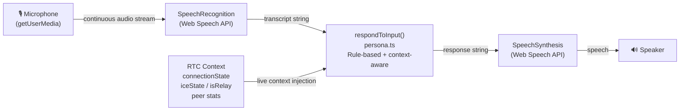
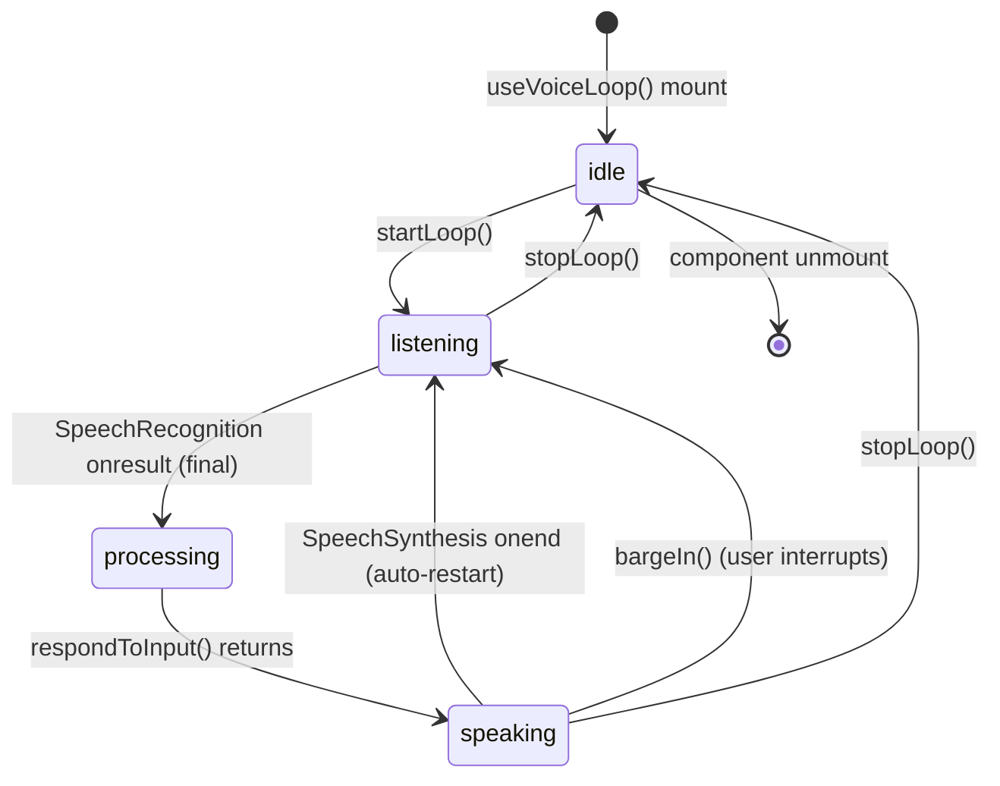

# Voice Pipeline & Local Model Integration

## Pipeline Overview

## State Machine

## Voice Modes

| Mode           | Constant              | Behaviour                                              |
|----------------|----------------------|--------------------------------------------------------|
| RTC Operations | VOICE_MODES.RTC_OPS  | Responds to WebRTC status queries (peers, ICE, relay)  |
| Ambient        | VOICE_MODES.AMBIENT  | Narrates system state poetically at low cadence        |
| Silent         | VOICE_MODES.SILENT   | STT still runs, but TTS output is suppressed           |
