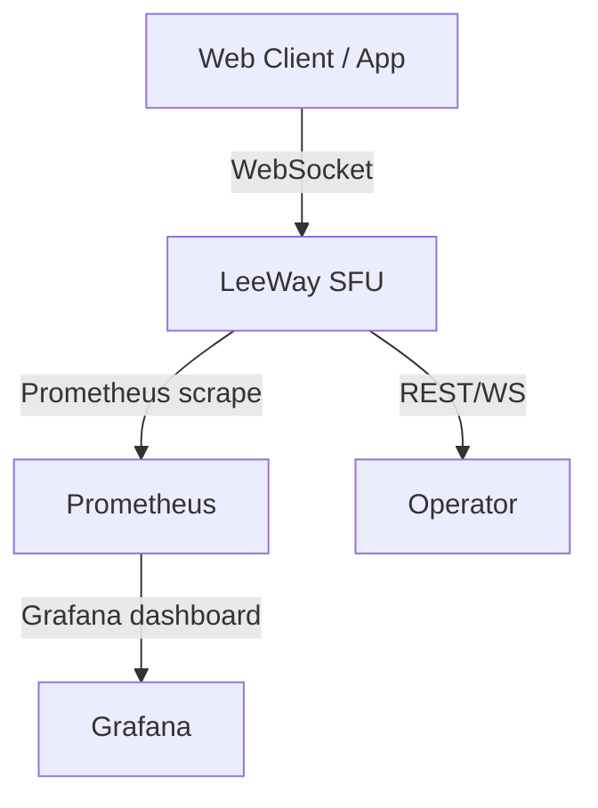

# Operations & Monitoring

## Monitoring Endpoints

- **Health:** `GET /health` — returns status and timestamp
- **Metrics:** `GET /metrics` — Prometheus/Grafana ready
- **Agents:** `GET /agents` — all agent snapshots
- **Connections:** `GET /connections` — all active peer connections
- **Rooms:** `GET /rooms` — all active rooms and peer details

## Metrics Overview

## Example Grafana Dashboard

- Active connections
- Room count
- Agent status
- Error rates
- CPU/memory usage

## Logs

- All agent and SFU logs are in `services/sfu/logs/`
- Per-agent logs: `logs/AGENT_NAME.log`
- Combined: `logs/combined.log`
