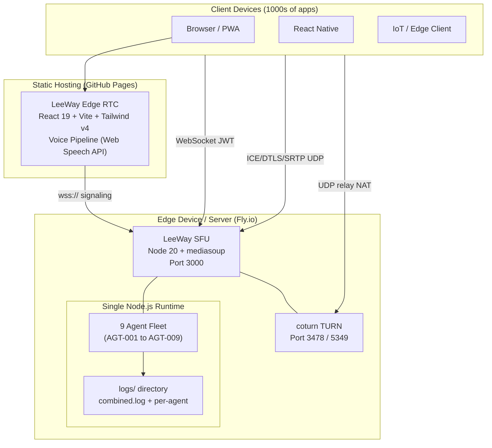
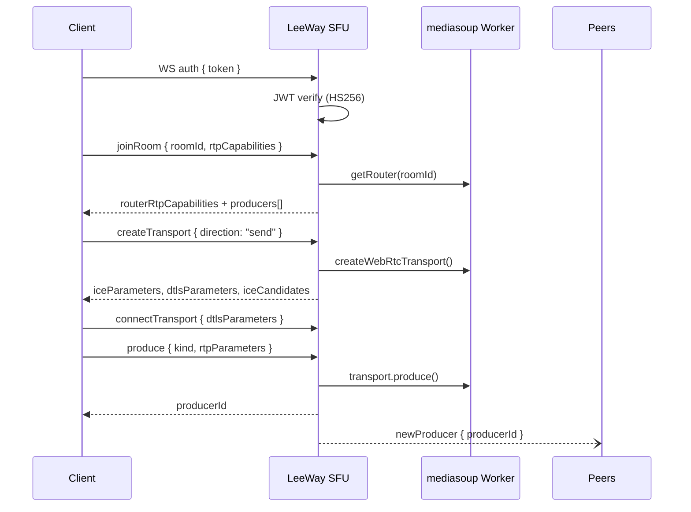
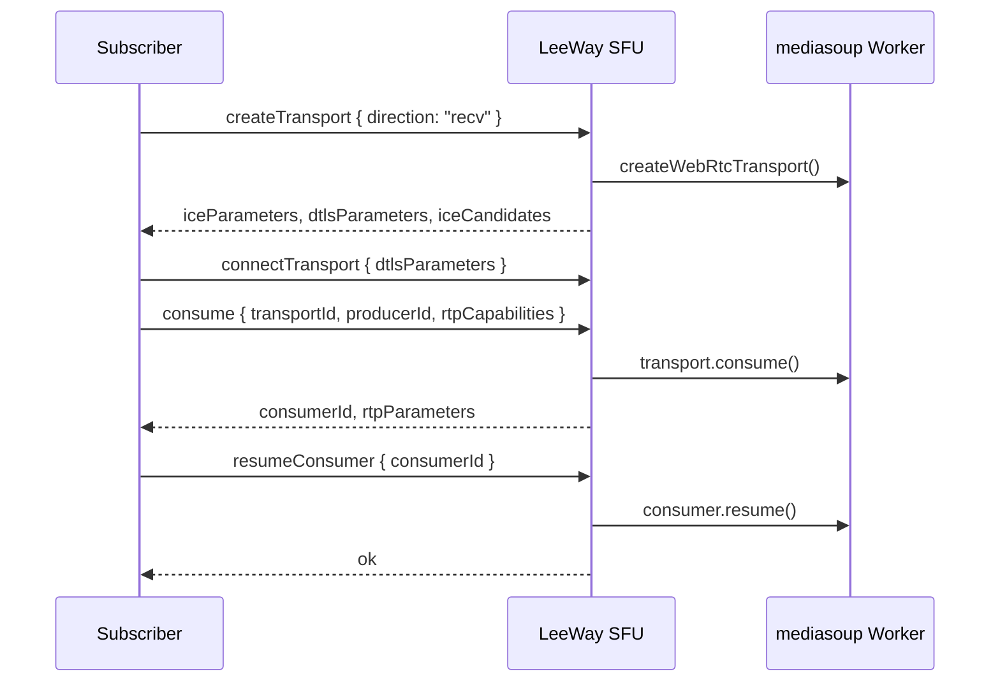
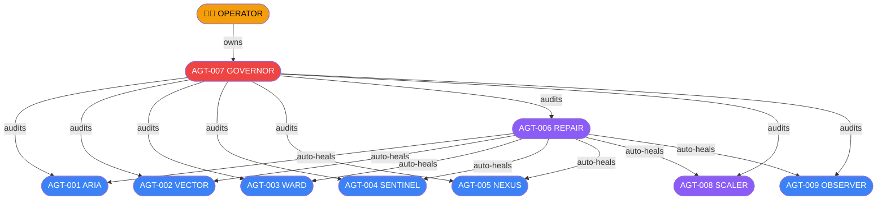

# LeeWay Edge RTC — System Overview

This document provides a high-level overview of the LeeWay Edge RTC system, including architecture, workflow, agent structure, local models, and operational tools. All diagrams are generated with Mermaid for easy maintenance.

---

## 1. System Architecture

---

## 2. Workflow: Publish/Subscribe

### Publish Path

### Subscribe Path

---

## 3. Agent Fleet & Governance

---

## 4. Local Model & Tools

- **Local LLM (optional):** Can be integrated via the slow lane for advanced reasoning.
- **Voice Pipeline:** 100% browser-native, no vendor APIs. See `docs/voice-pipeline.md` for details.
- **Call Mode Runtime:** Real-time voice session orchestration with SpeechRecognition API + saved voice config. See `docs/integration.md#call-mode-runtime` for details.
- **Monitoring:** Prometheus metrics at `/metrics`, connection/session APIs at `/connections` and `/rooms`.

---

## 5. Operations & Monitoring

- **Health:** `GET /health` — returns status and timestamp.
- **Metrics:** `GET /metrics` — Prometheus/Grafana ready.
- **Agents:** `GET /agents` — all agent snapshots.
- **Connections:** `GET /connections` — all active peer connections.
- **Rooms:** `GET /rooms` — all active rooms and peer details.

---

## 6. Setup & Integration

- See `docs/deployment.md` for deployment instructions (Docker, bare-metal, cloud).
- See `docs/integration.md` for client and app integration, including Call Mode runtime.
- See `docs/CALL_MODE_INTEGRATION.md` for Call Mode advanced setup and governance integration.
- See `docs/agents.md` for agent details and governance.
- See `docs/voice-pipeline.md` for voice and TTS/STT pipeline details.

---

## 7. Contact & Support

For questions, open an issue or contact LeeWay Industries.
