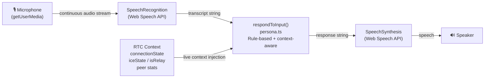
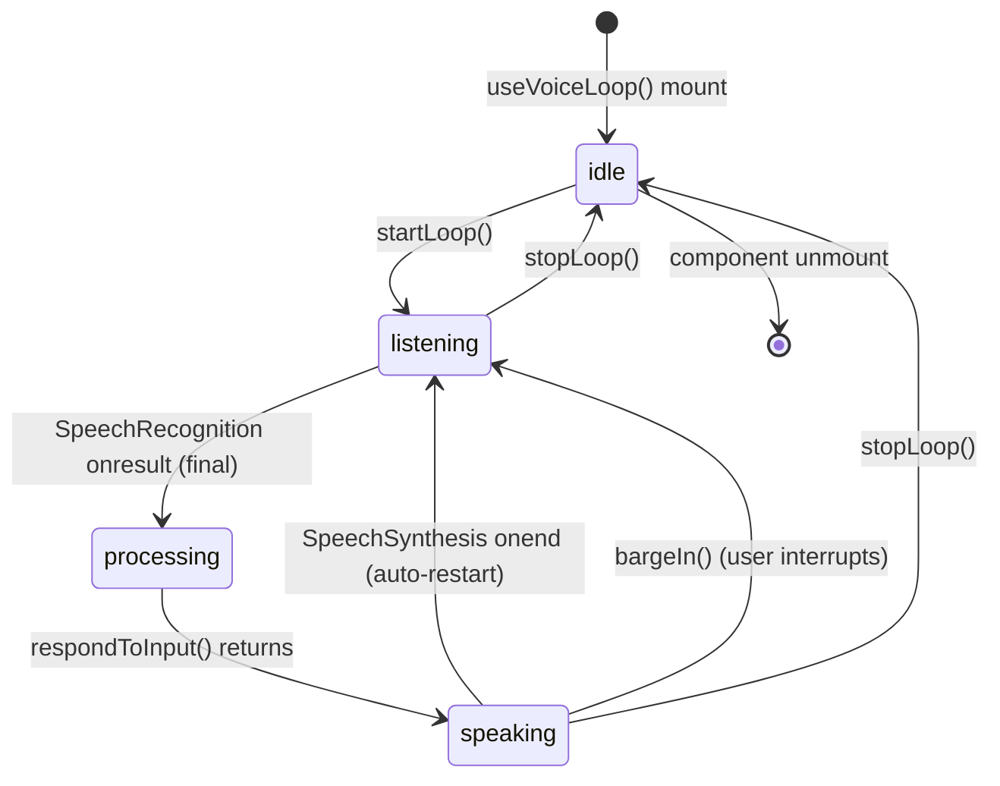
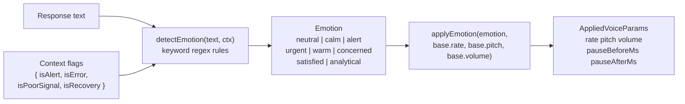
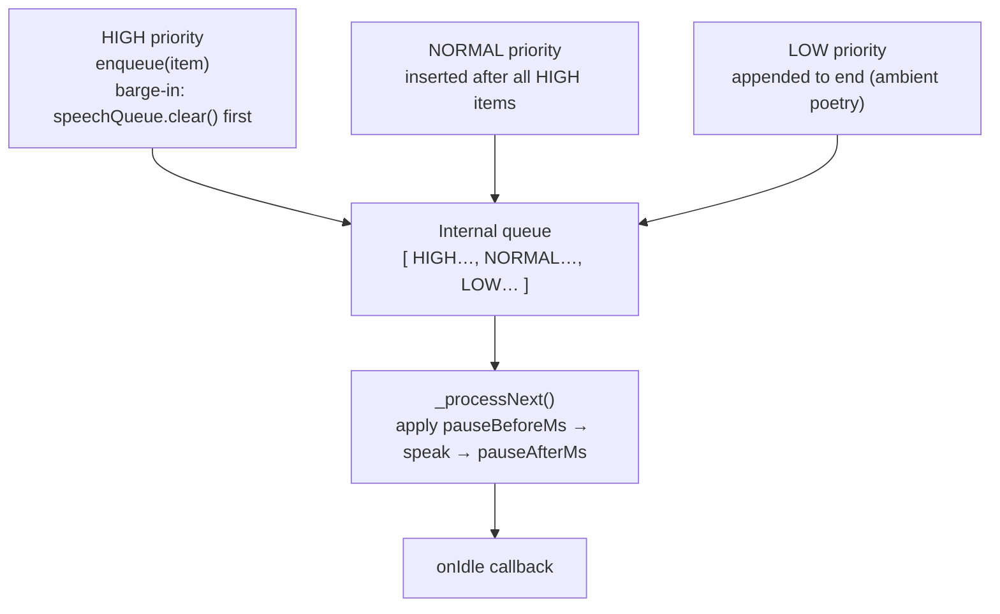

# Voice Pipeline

**LeeWay Industries | LeeWay Innovation — Created by Leonard Lee**

The LeeWay Edge RTC voice pipeline is **100% browser-native** — no external AI APIs, no vendor accounts, no network calls to third-party services. It runs entirely inside the client's browser using the Web Speech API.

---

## Pipeline Overview



---

## State Machine



---

## Module Map

| File | Purpose |
|---|---|
| [src/voice/voice-loop.ts](../src/voice/voice-loop.ts) | React hook `useVoiceLoop()` — orchestrates STT → Brain → TTS |
| [src/voice/persona.ts](../src/voice/persona.ts) | `respondToInput()` — local rule-based intelligence |
| [src/voice/voice-registry.ts](../src/voice/voice-registry.ts) | Runtime voice discovery, gender/quality classification |
| [src/voice/voice-presets.ts](../src/voice/voice-presets.ts) | 6 pinnable TTS profiles (3M + 3F) with localStorage persistence |
| [src/voice/emotion-engine.ts](../src/voice/emotion-engine.ts) | Text + context → `Emotion` → TTS rate/pitch/volume/pause deltas |
| [src/voice/speech-queue.ts](../src/voice/speech-queue.ts) | Priority TTS queue — HIGH barge-in, NORMAL standard, LOW ambient |
| [src/voice/audio.ts](../src/voice/audio.ts) | PCM worklet (optional WS voice server path) |
| [src/voice/poetry.ts](../src/voice/poetry.ts) | `getPoetryLine()` — ambient idle phrases for Agent Lee |
| [src/voice/types.ts](../src/voice/types.ts) | `VoiceMode`, `VoiceLoopState`, `RuntimeMode`, `SpeechPriority` types |

---

## Voice Modes

| Mode | Constant | Behaviour |
|---|---|---|
| RTC Operations | `VOICE_MODES.RTC_OPS` | Responds to WebRTC status queries (peers, ICE, relay, latency) |
| Ambient | `VOICE_MODES.AMBIENT` | Narrates system state poetically at low cadence |
| Silent | `VOICE_MODES.SILENT` | STT still runs, but TTS output is suppressed |

---

## Barge-In Support

When the user speaks while Agent Lee is talking, `bargeIn()` immediately:
1. Calls `speechQueue.clear()` — cancels current utterance and empties the queue
2. Restarts `SpeechRecognition` in continuous listen mode

---

Six pinnable voice profiles are stored in `voice-presets.ts`. The user's preferred preset is persisted in `localStorage` via `savePresetId()`.

| ID | Label | Gender | Base Rate | Pitch | Best for | Premium HD | Languages |
|----|-------|--------|-----------|-------|---------|:---:|:---:|
| M1 | Agent Lee — Premium HD | Male | 1.00 | 0.98 | Mission-critical command | ✅ | en, es, fr, de |
| M2 | Agent Lee — Calm (Studio) | Male | 0.88 | 0.92 | Routine status reports | ✅ | en, it, ja |
| M3 | Agent Lee — Alert (Ultra) | Male | 1.12 | 1.05 | High-energy security flags | ✅ | en, pt, ru |
| F1 | Agent ARIA — Premium | Female | 1.00 | 1.00 | Health monitoring readouts | ✅ | en, zh, ko |
| F2 | Agent ARIA — Warm | Female | 0.92 | 0.97 | Advisory recommendations | — | en, fr, nl |
| F3 | Agent ARIA — Technical | Female | 1.08 | 1.02 | Governance & diagnostic reports | ✅ | en, de, pl, hi |

Each preset has a `voiceNameHints[]` list — `voiceRegistry.findByHints()` picks the first matching voice available on the current device.

---

## Emotion Engine

The emotion engine in `emotion-engine.ts` maps response text (and optional RTC context flags) to a set of TTS parameter multipliers without any ML model.



Context overrides take priority over text patterns (an `isAlert: true` flag always resolves to `urgent` regardless of text content).

---

## Speech Queue

`speech-queue.ts` replaces direct `window.speechSynthesis.speak()` calls. Every TTS utterance is enqueued as a `SpeechItem` with a priority level.



---

## RTC Context Injection

The hook accepts a live `rtcState` object injected from the RTC store:

```ts
useVoiceLoop({
  connectionState: 'connected',
  iceState: 'completed',
  isRelay: false,
  peers: [{ packetLoss: 0.1, rtt: 22 }],
})
```

`persona.ts` reads this context to generate factual, real-time responses about the current WebRTC session — zero LLM calls, zero latency.

---

## Privacy & Vendor Independence

| Concern | How it's handled |
|---|---|
| STT data | Processed by the **browser's on-device or system ASR** — no cloud upload required |
| TTS voice | Rendered by the **browser's built-in speech synth** — no external TTS API |
| Brain / NLU | Pure **if/regex rule engine** in `persona.ts` — no LLM, no API key |
| Fonts / assets | Self-hosted via `@fontsource` — no Google Fonts CDN |

> The voice pipeline works offline on any device that implements the Web Speech API (Chrome, Edge, Safari 17+).
